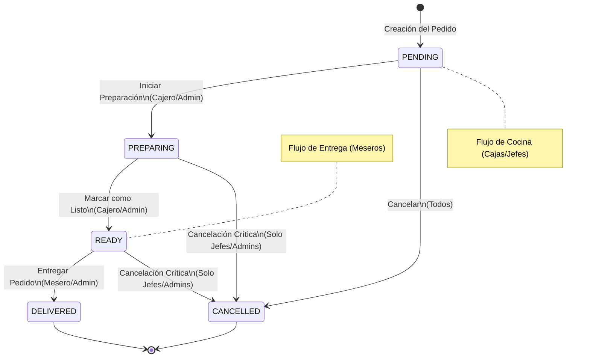
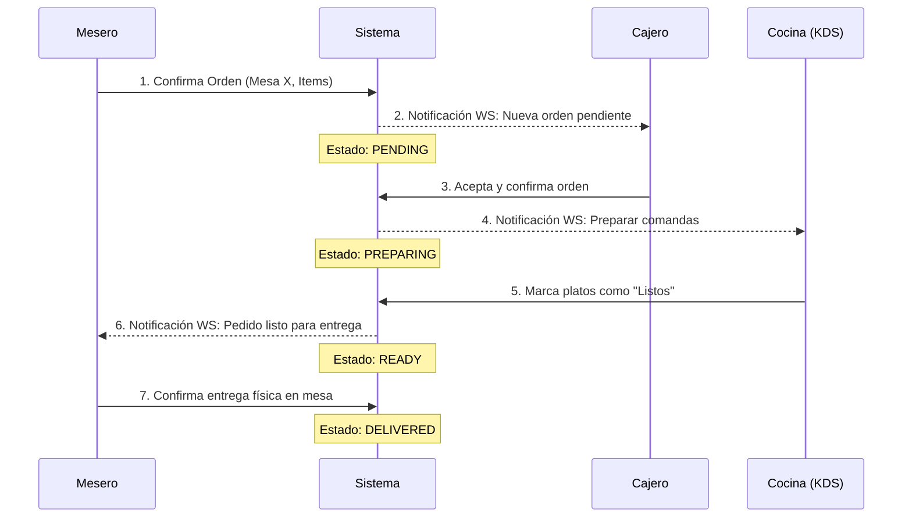

# 📋 Flujo de Órdenes y Permisos RBAC

Este documento describe el ciclo de vida de un pedido y los permisos requeridos para cada transición de estado, utilizando el sistema de Control de Acceso basado en Roles (RBAC).

## 🎭 Roles del Sistema

| Rol Lógico | Alias Soportados | Nivel de Acceso |
| :--- | :--- | :--- |
| **Mesero** | `waiter`, `server` | Operativo (Piso) |
| **Cajero/Jefe** | `cashier`, `manager` | Operativo (Control) |
| **Administrador**| `admin`, `owner`, `super_admin`| Total (Supervisión) |

---

## 🔄 1. Ciclo de Vida del Pedido (Diagrama de Estados)

Este diagrama muestra los estados por los que pasa un pedido desde su creación hasta su entrega o cancelación.

---

## 🤝 2. Interacción entre Actores (Diagrama de Secuencia)

Este diagrama detalla la comunicación en tiempo real entre los diferentes usuarios del sistema.

---

## 🔐 3. Matriz de Permisos por Transición

| Transición de Estado | Roles Autorizados | Acción en Sistema |
| :--- | :--- | :--- |
| `PENDIENTE` ➔ `PREPARANDO` | `cashier`, `manager`, `admin` | Confirmar pedido y enviar a cocina. |
| `PREPARANDO` ➔ `LISTO` | `cashier`, `manager`, `admin` | Notificar que el platillo está listo. |
| `LISTO` ➔ `ENTREGADO` | `waiter`, `server`, `admin` | Confirmar entrega en mesa/domicilio. |
| `Cualquiera` ➔ `CANCELADO` | `admin`, `owner`, `manager` | Anulación directa con auditoría corporativa. |
| `PENDIENTE` ➔ `CANCELADO` | **Todos** | Cancelación rápida permitida a meseros por error de captura inicial. |
| `PREPARANDO` ➔ `CANCELADO` | `waiter` (Solicita) | **Requiere Aprobación**: El mesero solicita, y debe ser aprobada por Cocina, Cajero o Admin. |

## 🛠️ 4. Reglas de Negocio Implementadas

1. **Separación de Funciones**: Los meseros (`server`) no pueden manipular los tiempos de cocina. Su responsabilidad principal es la entrega (`DELIVERED`).
2. **Control de Caja**: Los cajeros (`cashier`) orquestan la cocina pero no marcan la entrega final para evitar fraudes o inconsistencias en los tiempos de servicio.
3. **Flujo de Cancelación con Veto (V9.2)**: 
   - En estado **PENDIENTE**: Cualquier rol puede cancelar directamente.
   - En estado **PREPARANDO**:
     - El mesero puede **solicitar** la cancelación.
     - Se notifica a **Cocina, Cajero y Admin**.
     - **Aprobación**: Cualquiera de estos 3 roles puede aprobar la solicitud para hacer efectiva la cancelación.
     - **Veto (Denegación)**: Si cualquiera de estos 3 roles deniega la solicitud, la cancelación se rechaza y el pedido continúa su flujo normal.
4. **Retorno de Insumos**: Toda cancelación (aprobada o directa) dispara el retorno automático de los ingredientes al inventario (FIFO).
5. **Supervisión**: Los administradores (`admin`, `owner`) tienen "bypass", pudiendo intervenir en cualquier etapa del flujo.
6. **Validación Case-Insensitive**: El backend procesa los roles ignorando mayúsculas/minúsculas para evitar errores entre plataformas (Móvil vs Web).

---

> **Nota para el Usuario:** Para visualizar los diagramas correctamente, usa `Ctrl + Shift + V` en VS Code con la extensión **Markdown Preview Mermaid Support**.
