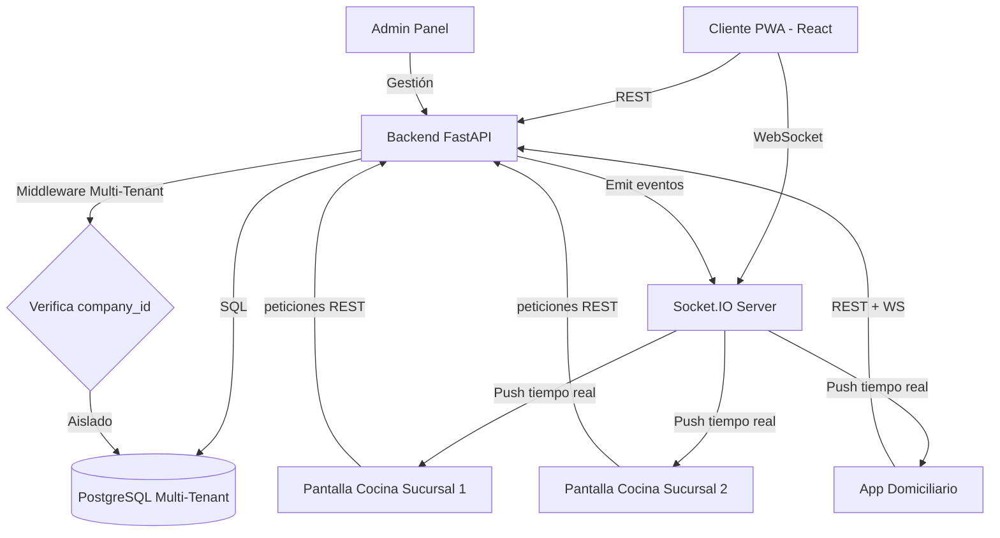

# FastOps – Documento de Requisitos, Arquitectura y Plan de Desarrollo

**Versión: 1.1 (Actualizado con Multi-Tenant)**  
**Autor:** Jhon (cliente) / Equipo de desarrollo  
**Resumen:** Este documento consolida todos los acuerdos, decisiones de arquitectura, requerimientos funcionales y no funcionales, y la hoja de ruta ordenada por prioridades para el desarrollo del sistema FastOps – Sistema Integral de Pedidos y Control Interno para Salchipapererías.

---

## 1. Información general del proyecto

**Nombre del sistema:** FastOps 
**Objetivo:** Construir un sistema que gestione pedidos (mesas, para llevar, domicilios), comandas para cocina, control de domiciliarios, caja, inventario con recetas, reportes y asignación inteligente de repartidores. La presentación para clientes será una PWA (React + TypeScript + Tailwind + Redux Toolkit). Toda la lógica financiera y operativa crítica reside en el backend (FastAPI + SQLModel + PostgreSQL).

**Alcance inicial:** MVP desktop/tienda PWA + backend + módulo opcional de app nativa para domiciliarios.

### 1.1 Modelo de Negocio SaaS (NUEVO)

El sistema se construirá como **plataforma SaaS multi-tenant** desde el inicio, permitiendo:

- **Múltiples negocios** usando la misma instalación
- **Múltiples sucursales** por cada negocio
- **Datos aislados y seguros** entre negocios
- **Suscripción mensual** por negocio

**Planes propuestos:**

- **Free:** 30 días prueba, 1 sucursal, 3 usuarios
- **Basic:** $40.000 COP/mes, 1 sucursal, 5 usuarios
- **Premium:** $80.000 COP/mes, sucursales ilimitadas, usuarios ilimitados

### Uso del sistema por parte de los clientes (PWA Cliente)

La solución contempla una aplicación web tipo PWA para los clientes finales, a la cual podrán acceder desde un código QR ubicado en mesas, empaques o publicidad. Esta aplicación permitirá que los clientes realicen pedidos directamente, sin necesidad de escribir por WhatsApp ni esperar respuesta del negocio.

**Características principales de la PWA Cliente:**

- Menú visual completamente administrable desde el panel del negocio
- Selección de productos, extras, tamaños o notas
- Elección del tipo de pedido: Mesa (con número de mesa), Para Llevar o Domicilio
- Registro opcional de cliente (nombre, teléfono, dirección para domicilios)
- Envío del pedido directamente al backend → cocina → caja
- Recepción de actualizaciones en tiempo real ("Tu pedido está en preparación", "Tu pedido está listo")
- Integración con pasarela de pagos en fases futuras

**Impacto en los dolores del negocio:**

- Elimina la dependencia de WhatsApp para recibir pedidos
- Ahorra tiempo al personal y reduce errores en la toma de órdenes
- Crea trazabilidad completa del pedido desde el cliente hasta la entrega
- Permite operar más mesas con menos personal

---

## 2. Arquitectura seleccionada (oficial)

### 2.1 Estrategia Multi-Tenant (NUEVO)

**Enfoque:** Base de datos única con aislamiento por `company_id` y `branch_id`

**Razones:**

- Menor costo de infraestructura
- Backups centralizados
- Actualizaciones simultáneas para todos los clientes
- Escalabilidad probada (hasta 1000+ negocios en un VPS)

**Seguridad:**

- Todos los queries filtran automáticamente por `company_id`
- Middleware de verificación en cada endpoint
- JWT incluye `company_id` y `branch_id`
- WebSockets con rooms aislados por negocio

**Acceso por subdominios:**

```
admin.FastOps.com              → Panel super-admin
elrincon.FastOps.com           → Panel negocio "El Rincón"
cliente.elrincon.FastOps.com   → PWA clientes
```

### 2.2 Frontend

**Stack:** React + TypeScript + TailwindCSS + Redux Toolkit

**Distribución:** PWA desplegada en Vercel/Netlify/Cloudflare Pages

**Responsabilidad:** Capa de presentación; no contiene lógica crítica (no cálculos financieros ni validaciones de inventario).

### 2.3 Backend

**Stack:** FastAPI + SQLModel + PostgreSQL

**Responsabilidad:** Única fuente de verdad; contiene toda la lógica de negocio, validaciones, cálculos financieros, consecutivos, cuadres y auditoría.

**Despliegue recomendado:** VPS (Contabo/Hetzner/DigitalOcean) – plan básico desde ~5 USD/mes.

### 2.4 App nativa (opcional)

**Plataforma:** Android nativa simple (o Flutter si se desea multi-plataforma en futuro)

**Uso:** Domiciliarios – login, recepción de pedidos, envío de ubicación, confirmación de entrega con GPS y detección de proximidad al local.

---

## 3. Requerimientos resumen (funcionales principales)

(Resumido – el documento completo de requisitos se mantiene en la sección Documents / Requisitos)

1. Gestión de productos y recetas (receta obligatoria para que el descuento automático funcione)
2. Pedidos: Mesa (M-XXX), Para Llevar (L-XXX), Domicilio (D-XXX). Consecutivos en backend
3. Comandas imprimibles para cocina (impresora térmica USB)
4. Control de domiciliarios: asignación manual/automática, registro de entregas, cuadre de turnos
5. Inventario: insumos, unidades, entradas, movimientos, descuento automático por receta
6. Caja y cierres: registro de métodos de pago, cuadre esperado vs real, reporte de diferencias
7. Reportes: ventas, inventario, domiciliarios, consumo por producto
8. Seguridad: roles (Administrador, Cajero, Cocina, Domiciliario), autenticación JWT
9. Auditoría: logs de acciones críticas
10. **Multi-tenant:** Gestión de múltiples negocios y sucursales (NUEVO)
11. **Suscripciones:** Sistema de planes y facturación (NUEVO)

---

## 4. Requerimientos no funcionales (resumen)

- Sistema local-first: debe poder correr con base de datos local en VPS o incluso en LAN para modo offline
- Rendimiento: respuesta < 300 ms para endpoints críticos; soportar 200 pedidos/día mínimo
- Seguridad: transportes via HTTPS; contraseñas hasheadas (bcrypt); roles y permisos
- Disponibilidad: backups regulares; recuperación ante corte de energía (persistencia de datos locales)
- **Aislamiento multi-tenant:** Ningún negocio puede ver datos de otro (NUEVO)
- **Escalabilidad:** Soportar hasta 100 negocios simultáneos sin degradación (NUEVO)

---

## 5. Modelo de datos (completo con multi-tenant)

### 🟦 TABLAS NUEVAS (Multi-Tenant Core)

#### 1. Tabla: `companies`

**Descripción:** Negocios/clientes del SaaS

| Campo         | Tipo         | Descripción                                |
| ------------- | ------------ | ------------------------------------------ |
| id (PK)       | int          | Identificador único                        |
| name          | varchar(200) | Nombre comercial                           |
| slug          | varchar(100) | UNIQUE - Para subdominios (ej: "elrincon") |
| legal_name    | varchar(200) | Razón social                               |
| tax_id        | varchar(50)  | NIT/RUT                                    |
| owner_name    | varchar(200) | Nombre del dueño                           |
| owner_email   | varchar(200) | UNIQUE - Email del dueño                   |
| owner_phone   | varchar(50)  | Teléfono contacto                          |
| plan          | varchar(20)  | free, basic, premium                       |
| is_active     | bool         | Si puede operar                            |
| trial_ends_at | timestamp    | Fin del período de prueba                  |
| timezone      | varchar(50)  | America/Bogota                             |
| currency      | varchar(3)   | COP                                        |
| max_users     | int          | Límite según plan                          |
| max_branches  | int          | Límite según plan                          |
| max_products  | int          | Límite según plan                          |
| created_at    | timestamp    | Fecha de registro                          |
| updated_at    | timestamp    | Última actualización                       |
| deleted_at    | timestamp    | Soft delete                                |

**Índices:**

- `idx_companies_slug` en (slug)
- `idx_companies_active` en (is_active)

---

#### 2. Tabla: `branches`

**Descripción:** Sucursales de cada negocio

| Campo           | Tipo          | Descripción                                |
| --------------- | ------------- | ------------------------------------------ |
| id (PK)         | int           | Identificador único                        |
| company_id (FK) | int           | → companies.id                             |
| name            | varchar(200)  | Nombre de sucursal (ej: "Sucursal Centro") |
| code            | varchar(20)   | Código corto (ej: "CENT", "NORTE")         |
| address         | text          | Dirección física                           |
| phone           | varchar(50)   | Teléfono de la sucursal                    |
| latitude        | numeric(10,8) | GPS - Latitud                              |
| longitude       | numeric(11,8) | GPS - Longitud                             |
| is_active       | bool          | Si está operando                           |
| is_main         | bool          | Si es sucursal principal                   |
| created_at      | timestamp     | Fecha de creación                          |
| updated_at      | timestamp     | Última actualización                       |

**Restricciones:**

- UNIQUE(company_id, code)

**Índices:**

- `idx_branches_company` en (company_id)
- `idx_branches_active` en (company_id, is_active)

---

#### 3. Tabla: `subscriptions`

**Descripción:** Suscripciones y facturación

| Campo                  | Tipo          | Descripción                           |
| ---------------------- | ------------- | ------------------------------------- |
| id (PK)                | int           | Identificador único                   |
| company_id (FK)        | int           | → companies.id                        |
| plan                   | varchar(20)   | free, basic, premium                  |
| status                 | varchar(20)   | active, cancelled, past_due, trialing |
| started_at             | timestamp     | Inicio de suscripción                 |
| current_period_start   | timestamp     | Inicio período actual                 |
| current_period_end     | timestamp     | Fin período actual                    |
| cancelled_at           | timestamp     | Fecha de cancelación                  |
| amount                 | numeric(12,2) | Monto a pagar                         |
| currency               | varchar(3)    | COP                                   |
| stripe_subscription_id | varchar(100)  | ID en Stripe (futuro)                 |
| wompi_subscription_id  | varchar(100)  | ID en Wompi (futuro)                  |
| created_at             | timestamp     | Fecha de creación                     |
| updated_at             | timestamp     | Última actualización                  |

**Índices:**

- `idx_subscriptions_company` en (company_id)
- `idx_subscriptions_status` en (status, current_period_end)

---

#### 4. Tabla: `order_counters`

**Descripción:** Consecutivos por sucursal y tipo de pedido

| Campo           | Tipo        | Descripción             |
| --------------- | ----------- | ----------------------- |
| id (PK)         | int         | Identificador único     |
| company_id (FK) | int         | → companies.id          |
| branch_id (FK)  | int         | → branches.id           |
| order_type      | varchar(20) | mesa, llevar, domicilio |
| last_number     | int         | Último número usado     |

**Restricciones:**

- UNIQUE(company_id, branch_id, order_type)

**Índices:**

- `idx_order_counters` en (company_id, branch_id, order_type)

---

### 🟨 TABLAS ACTUALIZADAS (con multi-tenant)

#### 5. Tabla: `usuarios` (ACTUALIZADA)

**Campos NUEVOS agregados:**

- `company_id` (FK) → companies.id - **OBLIGATORIO**
- `branch_id` (FK) → branches.id - NULL si es admin multi-sucursal
- `email` varchar(200)
- `actualizado_en` timestamp
- `ultimo_login` timestamp

| Campo               | Tipo             | Descripción                         |
| ------------------- | ---------------- | ----------------------------------- |
| id (PK)             | int              | identificador                       |
| **company_id (FK)** | **int**          | **→ companies.id (NUEVO)**          |
| **branch_id (FK)**  | **int**          | **→ branches.id (NUEVO)**           |
| nombre              | varchar          | nombre completo                     |
| usuario             | varchar          | unique por company - login          |
| **email**           | **varchar(200)** | **(NUEVO)**                         |
| contraseña_hash     | varchar          | hash bcrypt                         |
| rol                 | enum             | admin, cajero, cocina, domiciliario |
| activo              | bool             | si puede iniciar sesión             |
| creado_en           | timestamp        | fecha registro                      |
| **actualizado_en**  | **timestamp**    | **(NUEVO)**                         |
| **ultimo_login**    | **timestamp**    | **(NUEVO)**                         |

**Restricciones actualizadas:**

- UNIQUE(company_id, usuario) - Cada negocio puede tener su propio "admin"

**Índices:**

- `idx_usuarios_company` en (company_id)
- `idx_usuarios_branch` en (branch_id)
- `idx_usuarios_login` en (company_id, usuario, activo)

---

#### 6. Tabla: `categorias` (ACTUALIZADA)

**Campos NUEVOS:**

- `company_id` (FK) → companies.id - **OBLIGATORIO**
- `activo` bool

| Campo               | Tipo     | Descripción                |
| ------------------- | -------- | -------------------------- |
| id (PK)             | int      | identificador              |
| **company_id (FK)** | **int**  | **→ companies.id (NUEVO)** |
| nombre              | varchar  | nombre de categoría        |
| **activo**          | **bool** | **(NUEVO)**                |

**Restricciones:**

- UNIQUE(company_id, nombre)

**Índices:**

- `idx_categorias_company` en (company_id)

---

#### 7. Tabla: `productos` (ACTUALIZADA)

**Campos NUEVOS:**

- `company_id` (FK) → companies.id - **OBLIGATORIO**
- `imagen_url` varchar(500)
- `creado_en` timestamp
- `actualizado_en` timestamp

| Campo               | Tipo             | Descripción                |
| ------------------- | ---------------- | -------------------------- |
| id (PK)             | int              | identificador              |
| **company_id (FK)** | **int**          | **→ companies.id (NUEVO)** |
| nombre              | varchar          | nombre del producto        |
| descripcion         | varchar          | descripción                |
| precio              | numeric(12,2)    | precio de venta            |
| categoria_id (FK)   | int              | → categorias.id            |
| **imagen_url**      | **varchar(500)** | **(NUEVO)**                |
| activo              | bool             | si está disponible         |
| **creado_en**       | **timestamp**    | **(NUEVO)**                |
| **actualizado_en**  | **timestamp**    | **(NUEVO)**                |

**Relación:** 1 categoría → muchos productos

**Índices:**

- `idx_productos_company` en (company_id)
- `idx_productos_categoria` en (company_id, categoria_id)
- `idx_productos_activos` en (company_id, activo)

---

#### 8. Tabla: `insumos` (ACTUALIZADA)

**Campos NUEVOS:**

- `company_id` (FK) → companies.id - **OBLIGATORIO**
- `branch_id` (FK) → branches.id - NULL si es compartido entre sucursales
- `creado_en` timestamp

| Campo               | Tipo          | Descripción                |
| ------------------- | ------------- | -------------------------- |
| id (PK)             | int           | identificador              |
| **company_id (FK)** | **int**       | **→ companies.id (NUEVO)** |
| **branch_id (FK)**  | **int**       | **→ branches.id (NUEVO)**  |
| nombre              | varchar       | nombre del insumo          |
| unidad_medida       | varchar       | g, ml, unidades            |
| stock_actual        | numeric       | stock disponible           |
| stock_minimo        | numeric       | alerta de reorden          |
| costo_promedio      | numeric(12,4) | costo promedio ponderado   |
| activo              | bool          | si está en uso             |
| **creado_en**       | **timestamp** | **(NUEVO)**                |

**Índices:**

- `idx_insumos_company` en (company_id)
- `idx_insumos_branch` en (branch_id)
- `idx_insumos_stock` en (company_id, stock_actual, stock_minimo)

---

#### 9. Tabla: `recetas` (ACTUALIZADA)

**Campos NUEVOS:**

- `company_id` (FK) → companies.id - **OBLIGATORIO**

| Campo               | Tipo    | Descripción                |
| ------------------- | ------- | -------------------------- |
| id (PK)             | int     | identificador              |
| **company_id (FK)** | **int** | **→ companies.id (NUEVO)** |
| producto_id (FK)    | int     | → productos.id             |
| descripcion         | text    | notas de preparación       |

**Relación:** 1 producto → 1 receta

---

#### 10. Tabla: `receta_detalle`

**Nota:** Hereda `company_id` de la tabla `recetas`, no necesita campo adicional.

| Campo          | Tipo    | Descripción        |
| -------------- | ------- | ------------------ |
| id (PK)        | int     | identificador      |
| receta_id (FK) | int     | → recetas.id       |
| insumo_id (FK) | int     | → insumos.id       |
| cantidad       | numeric | cantidad requerida |

**Relaciones:**

- N ingredientes → 1 receta
- Muchos ingredientes → muchos insumos

---

#### 11. Tabla: `inventario_movimientos` (ACTUALIZADA)

**Campos NUEVOS:**

- `company_id` (FK) → companies.id - **OBLIGATORIO**
- `branch_id` (FK) → branches.id - **OBLIGATORIO**

| Campo               | Tipo          | Descripción                |
| ------------------- | ------------- | -------------------------- |
| id (PK)             | int           | identificador              |
| **company_id (FK)** | **int**       | **→ companies.id (NUEVO)** |
| **branch_id (FK)**  | **int**       | **→ branches.id (NUEVO)**  |
| insumo_id (FK)      | int           | → insumos.id               |
| tipo                | enum          | entrada, salida, ajuste    |
| cantidad            | numeric       | cantidad del movimiento    |
| costo_unitario      | numeric(12,4) | NULL en salidas            |
| motivo              | varchar       | razón del movimiento       |
| referencia          | varchar       | id pedido o nota           |
| usuario_id (FK)     | int           | → usuarios.id              |
| creado_en           | timestamp     | fecha del movimiento       |

**Índices:**

- `idx_inventario_company_branch` en (company_id, branch_id)
- `idx_inventario_fecha` en (company_id, creado_en)

---

#### 12. Tabla: `pedidos` (ACTUALIZADA)

**Campos NUEVOS:**

- `company_id` (FK) → companies.id - **OBLIGATORIO**
- `branch_id` (FK) → branches.id - **OBLIGATORIO**
- `actualizado_en` timestamp

**Cambio en consecutivo:** Ahora incluye código de sucursal (ej: M-CENT-001, L-NORTE-015)

| Campo                | Tipo          | Descripción                                            |
| -------------------- | ------------- | ------------------------------------------------------ |
| id (PK)              | int           | identificador                                          |
| **company_id (FK)**  | **int**       | **→ companies.id (NUEVO)**                             |
| **branch_id (FK)**   | **int**       | **→ branches.id (NUEVO)**                              |
| consecutivo          | varchar(50)   | UNIQUE - M-CENT-001, L-NORTE-015                       |
| tipo                 | enum          | mesa, llevar, domicilio                                |
| mesa                 | varchar       | NULL si no es mesa                                     |
| cliente_nombre       | varchar       | NULL si no aplica                                      |
| cliente_telefono     | varchar       | NULL si no aplica                                      |
| direccion            | varchar       | NULL si no es domicilio                                |
| estado               | enum          | pendiente, en_preparacion, listo, entregado, cancelado |
| total                | numeric(12,2) | total del pedido                                       |
| domiciliario_id (FK) | int           | → usuarios.id - NULL si no aplica                      |
| creado_por (FK)      | int           | → usuarios.id                                          |
| creado_en            | timestamp     | fecha de creación                                      |
| **actualizado_en**   | **timestamp** | **(NUEVO)**                                            |

**Restricciones:**

- UNIQUE(company_id, consecutivo)

**Índices:**

- `idx_pedidos_company_branch` en (company_id, branch_id)
- `idx_pedidos_estado` en (company_id, estado, creado_en)
- `idx_pedidos_consecutivo` en (company_id, consecutivo)
- `idx_pedidos_domiciliario` en (domiciliario_id, estado)

---

#### 13. Tabla: `detalle_pedidos`

**Nota:** Hereda `company_id` y `branch_id` del pedido, no necesita campos adicionales.

| Campo            | Tipo          | Descripción                |
| ---------------- | ------------- | -------------------------- |
| id (PK)          | int           | identificador              |
| pedido_id (FK)   | int           | → pedidos.id               |
| producto_id (FK) | int           | → productos.id             |
| cantidad         | int           | unidades                   |
| precio_unitario  | numeric(12,2) | precio al momento de venta |
| subtotal         | numeric(12,2) | cantidad × precio_unitario |

---

#### 14. Tabla: `pagos`

**Nota:** Hereda contexto del pedido.

| Campo          | Tipo          | Descripción                       |
| -------------- | ------------- | --------------------------------- |
| id (PK)        | int           | identificador                     |
| pedido_id (FK) | int           | → pedidos.id                      |
| metodo         | enum          | efectivo, transferencia, datáfono |
| monto          | numeric(12,2) | cantidad pagada                   |
| referencia     | varchar       | NULL - número de transacción      |
| creado_en      | timestamp     | fecha de pago                     |

---

#### 15. Tabla: `cierres_caja` (ACTUALIZADA)

**Campos NUEVOS:**

- `company_id` (FK) → companies.id - **OBLIGATORIO**
- `branch_id` (FK) → branches.id - **OBLIGATORIO**

| Campo               | Tipo      | Descripción                |
| ------------------- | --------- | -------------------------- |
| id (PK)             | int       | identificador              |
| **company_id (FK)** | **int**   | **→ companies.id (NUEVO)** |
| **branch_id (FK)**  | **int**   | **→ branches.id (NUEVO)**  |
| usuario_id (FK)     | int       | → usuarios.id              |
| total_esperado      | numeric   | calculado por sistema      |
| total_real          | numeric   | contado físicamente        |
| diferencia          | numeric   | real - esperado            |
| notas               | text      | NULL - observaciones       |
| creado_en           | timestamp | fecha del cierre           |

**Índices:**

- `idx_cierres_company_branch` en (company_id, branch_id)
- `idx_cierres_fecha` en (company_id, creado_en)

---

#### 16. Tabla: `domiciliarios_ubicacion` (ACTUALIZADA)

**Campos NUEVOS:**

- `company_id` (FK) → companies.id - **OBLIGATORIO**

| Campo                | Tipo      | Descripción                |
| -------------------- | --------- | -------------------------- |
| id (PK)              | int       | identificador              |
| **company_id (FK)**  | **int**   | **→ companies.id (NUEVO)** |
| domiciliario_id (FK) | int       | → usuarios.id              |
| lat                  | numeric   | latitud GPS                |
| lng                  | numeric   | longitud GPS               |
| creado_en            | timestamp | timestamp de ubicación     |

**Índices:**

- `idx_ubicacion_company` en (company_id, domiciliario_id)

---

#### 17. Tabla: `domiciliarios_estado` (ACTUALIZADA)

**Campos NUEVOS:**

- `company_id` (FK) → companies.id - **OBLIGATORIO**

| Campo                | Tipo      | Descripción                                 |
| -------------------- | --------- | ------------------------------------------- |
| id (PK)              | int       | identificador                               |
| **company_id (FK)**  | **int**   | **→ companies.id (NUEVO)**                  |
| domiciliario_id (FK) | int       | → usuarios.id                               |
| estado               | enum      | disponible, en_ruta, entregando, en_negocio |
| actualizado_en       | timestamp | última actualización                        |

---

#### 18. Tabla: `configuraciones` (ACTUALIZADA)

**Campos NUEVOS:**

- `company_id` (FK) → companies.id - **OBLIGATORIO**

| Campo               | Tipo    | Descripción                |
| ------------------- | ------- | -------------------------- |
| id (PK)             | int     | identificador              |
| **company_id (FK)** | **int** | **→ companies.id (NUEVO)** |
| clave               | varchar | nombre del parámetro       |
| valor               | varchar | valor del parámetro        |

**Restricciones:**

- UNIQUE(company_id, clave)

---

#### 19. Tabla: `logs` (ACTUALIZADA)

**Campos NUEVOS:**

- `company_id` (FK) → companies.id - **OBLIGATORIO**
- `branch_id` (FK) → branches.id - NULL si aplica a toda la compañía
- `ip_address` varchar(50)
- `user_agent` text

| Campo               | Tipo            | Descripción                |
| ------------------- | --------------- | -------------------------- |
| id (PK)             | int             | identificador              |
| **company_id (FK)** | **int**         | **→ companies.id (NUEVO)** |
| **branch_id (FK)**  | **int**         | **→ branches.id (NUEVO)**  |
| usuario_id (FK)     | int             | → usuarios.id              |
| accion              | varchar         | tipo de acción             |
| entidad             | varchar         | tabla afectada             |
| entidad_id          | int             | ID del registro            |
| detalle             | text            | JSON con detalles          |
| **ip_address**      | **varchar(50)** | **(NUEVO)**                |
| **user_agent**      | **text**        | **(NUEVO)**                |
| creado_en           | timestamp       | fecha de la acción         |

**Índices:**

- `idx_logs_company` en (company_id, creado_en)
- `idx_logs_usuario` en (usuario_id, creado_en)
- `idx_logs_entidad` en (company_id, entidad, entidad_id)

---

### 🧠 RELACIONES (resumen visual con multi-tenant)

```
companies
├─ branches (múltiples sucursales)
├─ subscriptions (plan y facturación)
├─ usuarios (empleados del negocio)
├─ productos, categorias (catálogo del negocio)
└─ pedidos (órdenes por sucursal)

usuarios (con company_id y branch_id)
├─ crea pedidos
├─ hace movimientos inventario
├─ realiza cierres de caja
└─ genera logs de auditoría

categorias → productos → recetas → receta_detalle → insumos
(Cadena que permite descontar inventario automáticamente)

pedidos (con company_id y branch_id)
├─ detalle_pedidos → productos
├─ pagos
└─ domiciliarios (solo si tipo = domicilio)

branches (sucursales)
├─ insumos (stock por sucursal)
├─ pedidos (órdenes de esa sucursal)
├─ cierres_caja (cierres por sucursal)
└─ usuarios (empleados asignados)
```

---

## 6. Endpoints API (resumen con multi-tenant)

**Nota:** Todos los endpoints que modifican dinero, inventario o estados críticos se ejecutan en transacción y validan en backend.

### 🔐 Autenticación (ACTUALIZADO)

```
POST   /auth/register              # Registro nuevo negocio (self-service)
POST   /auth/login                 # Login (JWT con company_id y branch_id)
GET    /auth/me                    # Datos del usuario actual
POST   /auth/switch-branch         # Cambiar sucursal (admins)
```

### 🏢 Gestión de Negocios (NUEVO - Super Admin)

```
GET    /admin/companies            # Listar todos los negocios
GET    /admin/companies/{id}       # Detalle de negocio
PUT    /admin/companies/{id}       # Actualizar negocio
DELETE /admin/companies/{id}       # Desactivar negocio
POST   /admin/companies/{id}/activate  # Reactivar negocio
```

### 🏪 Gestión de Sucursales (NUEVO)

```
GET    /branches                   # Listar sucursales del negocio actual
POST   /branches                   # Crear nueva sucursal
GET    /branches/{id}              # Detalle de sucursal
PUT    /branches/{id}              # Actualizar sucursal
DELETE /branches/{id}              # Eliminar sucursal
```

### 💳 Suscripciones (NUEVO)

```
GET    /subscriptions/current      # Suscripción actual del negocio
POST   /subscriptions/upgrade      # Cambiar a plan superior
POST   /subscriptions/downgrade    # Cambiar a plan inferior
POST   /subscriptions/cancel       # Cancelar suscripción
GET    /subscriptions/invoices     # Historial de facturas
```

### 📦 Productos (filtrado automático por company_id)

```
GET    /products                   # Listar productos del negocio
POST   /products                   # Crear producto
PUT    /products/{id}              # Actualizar producto
DELETE /products/{id}              # Eliminar producto
POST   /products/{id}/recipe       # Crear/actualizar receta
```

### 🛒 Pedidos (filtrado por company_id y branch_id)

```
POST   /orders                     # Crear pedido (requiere branch_id)
GET    /orders/{id}                # Detalle de pedido
GET    /orders?branch_id=X         # Listar pedidos de sucursal
GET    /orders?estado=             # Filtrar por estado
POST   /orders/{id}/status         # Cambiar estado (validación server-side)
POST   /orders/{id}/assign         # Asignar domiciliario (manual)
```

### 🍳 Cocina (filtrado por branch_id)

```
GET    /kitchen/orders             # Pedidos por preparar (sucursal actual)
POST   /kitchen/orders/{id}/start  # Iniciar preparación
POST   /kitchen/orders/{id}/ready  # Marcar como listo
```

### 📦 Inventario (por sucursal)

```
GET    /inventory?branch_id=X      # Inventario de sucursal específica
POST   /inventory/entries          # Registrar entrada de insumos
POST   /inventory/movements        # Registro manual/ajuste
GET    /inventory/report           # Reporte de inventario
```

### 🚚 Domiciliarios

```
POST   /domiciliary/login          # Login domiciliario
GET    /domiciliary/me             # Datos del domiciliario
GET    /domiciliary/assigned       # Pedidos asignados
POST   /domiciliary/{id}/location  # Actualizar ubicación GPS
POST   /domiciliary/{id}/delivered # Marcar entrega (captura GPS)
```

### 💰 Caja y Reportes (por sucursal)

```
GET    /reports/daily?branch_id=X  # Reporte diario de sucursal
POST   /cash/close                 # Cierre de caja (branch_id requerido)
GET    /reports/domiciliarios/{id} # Reporte de domiciliario específico
GET    /reports/consolidated       # Reporte consolidado (todas las sucursales)
```

---

## 7. Reglas claves de diseño e integridad

### Reglas originales:

1. **Backend como fuente de la verdad:** Todos los cálculos financieros, de consecutivos y de inventario se realizan y validan en el backend
2. **Transacciones SQL:** Operaciones que afectan inventario + ventas deben realizarse como transacción atómica
3. **Logs y auditoría:** Cada cambio crítico (ajuste de inventario, cierre de caja, eliminación de pedido) debe registrarse con usuario y motivo
4. **Validación de stock:** Antes de confirmar venta, validar stock teórico y reservar insumos en la misma transacción
5. **Concurrencia:** Generación de consecutivos e inventario debe ser segura frente a concurrencia (bloqueos o secuencias en DB)

### Reglas NUEVAS (Multi-Tenant):

6. **Aislamiento de datos:** Todos los queries DEBEN filtrar por `company_id`. Ningún negocio puede ver datos de otro
7. **Verificación en JWT:** Cada request debe validar que el `company_id` del token coincide con los datos solicitados
8. **Consecutivos por sucursal:** Los consecutivos se generan independientemente por cada sucursal usando `order_counters`
9. **Inventario por sucursal:** El stock es independiente entre sucursales del mismo negocio
10. **Suscripción activa:** Endpoints críticos deben verificar que el plan del negocio esté activo y vigente
11. **Límites por plan:** Validar límites según plan (usuarios, sucursales, productos) antes de crear nuevos registros
12. **WebSockets aislados:** Cada negocio y sucursal tienen sus propias "rooms" para tiempo real

---

## 7.1 Middleware de Seguridad Multi-Tenant (NUEVO)

### Ejemplo de implementación:

```python
# backend/app/core/multi_tenant.py

from fastapi import Depends, HTTPException, status
from typing import Optional

async def verify_company_access(
    company_id: int,
    current_user: User = Depends(get_current_user)
):
    """
    Verifica que el usuario tenga acceso a la compañía solicitada
    """
    if current_user.company_id != company_id:
        raise HTTPException(
            status_code=status.HTTP_403_FORBIDDEN,
            detail="No tienes acceso a este negocio"
        )
    return True

async def verify_branch_access(
    branch_id: int,
    current_user: User = Depends(get_current_user)
):
    """
    Verifica acceso a sucursal específica
    - Admin: puede ver todas las sucursales de su negocio
    - Otros roles: solo su sucursal asignada
    """
    if current_user.rol == "admin":
        # Admin puede ver cualquier sucursal de su negocio
        branch = db.query(Branch).filter(
            Branch.id == branch_id,
            Branch.company_id == current_user.company_id
        ).first()

        if not branch:
            raise HTTPException(403, "Sucursal no encontrada")
        return True

    # Otros roles solo su sucursal
    if current_user.branch_id != branch_id:
        raise HTTPException(403, "No tienes acceso a esta sucursal")

    return True

async def verify_active_subscription(
    current_user: User = Depends(get_current_user)
):
    """
    Verifica que la suscripción del negocio esté activa
    """
    subscription = db.query(Subscription).filter(
        Subscription.company_id == current_user.company_id,
        Subscription.status == "active",
        Subscription.current_period_end > datetime.utcnow()
    ).first()

    if not subscription:
        raise HTTPException(
            status_code=status.HTTP_402_PAYMENT_REQUIRED,
            detail="Suscripción vencida. Por favor renueva tu plan."
        )

    return True

# Uso en endpoints:
@router.get("/orders")
async def get_orders(
    branch_id: int,
    current_user: User = Depends(get_current_user),
    _: bool = Depends(verify_branch_access),
    __: bool = Depends(verify_active_subscription)
):
    # Ya está todo verificado, seguro traer pedidos
    orders = db.query(Order).filter(
        Order.company_id == current_user.company_id,
        Order.branch_id == branch_id
    ).all()

    return orders
```

---

## 7.2 Sistema de Autenticación Multi-Tenant (NUEVO)

### Estructura del JWT:

```json
{
  "user_id": 123,
  "company_id": 5,
  "branch_id": 12,
  "role": "cajero",
  "plan": "premium",
  "exp": 1735689600
}
```

### Flujo de login:

1. Usuario envía credenciales + slug del negocio (opcional)
2. Backend busca usuario por username + company
3. Valida contraseña
4. Verifica que company está activa
5. Genera JWT con company_id y branch_id
6. Frontend almacena token y lo envía en cada request

---

## 7.3 Generación de Consecutivos por Sucursal (NUEVO)

### Formato de consecutivos:

```
M-CENT-001    # Mesa, Sucursal Centro, #001
M-CENT-002    # Mesa, Sucursal Centro, #002
M-NORTE-001   # Mesa, Sucursal Norte, #001
L-CENT-001    # Llevar, Sucursal Centro, #001
D-NORTE-015   # Domicilio, Sucursal Norte, #015
```

### Implementación segura:

```python
def generate_consecutive(
    company_id: int,
    branch_id: int,
    order_type: str,
    db: Session
) -> str:
    """
    Genera consecutivo único por sucursal con lock de DB
    """
    # Lock para evitar duplicados en concurrencia
    counter = db.query(OrderCounter).filter(
        OrderCounter.company_id == company_id,
        OrderCounter.branch_id == branch_id,
        OrderCounter.order_type == order_type
    ).with_for_update().first()

    if not counter:
        # Crear contador si no existe
        counter = OrderCounter(
            company_id=company_id,
            branch_id=branch_id,
            order_type=order_type,
            last_number=0
        )
        db.add(counter)

    # Incrementar
    counter.last_number += 1
    db.commit()

    # Obtener código de sucursal
    branch = db.query(Branch).get(branch_id)

    # Generar consecutivo
    prefix = {
        "mesa": "M",
        "llevar": "L",
        "domicilio": "D"
    }[order_type]

    return f"{prefix}-{branch.code}-{counter.last_number:03d}"
```

---

## 7.4 Módulo WebSockets â€" Tiempo Real (ACTUALIZADO)

**Objetivo:** Proveer comunicación en tiempo real entre Caja, Cocina y Domiciliarios mediante Socket.IO con aislamiento multi-tenant.

### Estructura de rooms con multi-tenant:

```
/kitchen-channel
├─ room: kitchen_company_5_branch_12   # Cocina negocio 5, sucursal 12
├─ room: kitchen_company_5_branch_13   # Cocina negocio 5, sucursal 13
└─ room: kitchen_company_7_branch_20   # Cocina negocio 7, sucursal 20

/dispatcher-channel
├─ room: dispatcher_company_5_branch_12
├─ room: dom_123  # Domiciliario específico
└─ room: dom_456
```

### Eventos con aislamiento:

```python
# Al crear pedido
socketio.emit(
    'newOrder',
    data=order_data,
    room=f"kitchen_company_{order.company_id}_branch_{order.branch_id}"
)

# Solo cocina de ESA sucursal específica recibe el evento
```

**Canales oficiales:**

- `/kitchen-channel`: Emite `newOrder`, `printComanda`, `orderUpdated`
- `/dispatcher-channel`: Emite `assignment`, `newDelivery`, `locationUpdate`, `deliveryComplete`, `domAvailable`

**Características clave:**

1. WebSockets solo informan, NO procesan lógica crítica
2. Se usa Socket.IO (python-socketio) para reconexión automática
3. Cada domiciliario se une a una "room" identificada (dom\_{id})
4. Cada sucursal tiene su room de cocina aislado
5. Caja ve actualizaciones solo de su sucursal (o todas si es admin)

---

## 8. Flujo de desarrollo (orden y entregables)

### Fase 0 â€" Preparación del repositorio (entregable inmediato)

**Duración:** 1 día

**Tareas:**

- Inicializar monorepo con carpetas `backend/` y `frontend/`
- Configurar linter/prettier y CI básico (opcional)
- Dockerfile para backend y configuración Vite para frontend
- Script de bootstrap (env, variables, README con cómo correr local)

---

### Fase 0.5 - Preparación Multi-Tenant (NUEVA - CRÍTICA)

**Duración:** 2 días  
**Prioridad:** ALTA - HACER ANTES DE FASE 1

**Tareas:**

1. Crear modelos SQLModel para:

   - `Company`
   - `Branch`
   - `Subscription`
   - `OrderCounter`

2. Actualizar TODOS los modelos existentes agregando:

   - `company_id` (obligatorio en mayoría)
   - `branch_id` (donde aplique)

3. Crear script de migración SQL:

   ```sql
   -- Crear tablas nuevas
   CREATE TABLE companies (...);
   CREATE TABLE branches (...);
   CREATE TABLE subscriptions (...);
   CREATE TABLE order_counters (...);

   -- Agregar campos a tablas existentes
   ALTER TABLE usuarios ADD COLUMN company_id INTEGER;
   ALTER TABLE usuarios ADD COLUMN branch_id INTEGER;
   -- ... repetir para todas las tablas
   ```

4. Crear seed data de prueba:

   - 2 companies de ejemplo
   - 2-3 branches por company
   - 1 usuario admin por company

5. Documentar modelo de datos actualizado

**Entregables:**

- Modelos SQLModel completos
- Script `migrations/001_multi_tenant.sql`
- Script `seeds/dev_data.py` con datos de prueba
- README actualizado con nueva estructura

**Validación:**
✅ Todas las tablas tienen `company_id`  
✅ Migraciones ejecutan sin errores  
✅ Seed data crea 2 negocios operativos  
✅ Queries filtran correctamente por company

---

### Fase 1 â€" Núcleo backend (Backend Core) â€" PRIORIDAD ALTA (ACTUALIZADA)

**Duración:** 1.5 semanas  
**Prioridad:** Crítica

**Tareas originales + nuevas:**

1. Estructura de la DB y modelos (SQLModel) + `db.init_db()` [Ya incluido en Fase 0.5]

2. Auth JWT (endpoints `/auth/token` y `/auth/me`) [ACTUALIZADO]:

   - Login incluye verificación de `company_id`
   - JWT contiene `company_id` y `branch_id`
   - Endpoint `/auth/register` para nuevos negocios
   - Endpoint `/auth/switch-branch` para cambiar sucursal

3. **Middleware multi-tenant (NUEVO):**

   - `verify_company_access()`
   - `verify_branch_access()`
   - `verify_active_subscription()`

4. **CRUD Negocios y Sucursales (NUEVO):**

   - Endpoints de gestión de companies
   - Endpoints de gestión de branches
   - Validación de límites por plan

5. CRUD Productos y Recetas:

   - Todos los queries filtran por `company_id`
   - Validación de receta obligatoria

6. Inventario: tablas de insumos y movimientos:

   - Separado por `branch_id`
   - Stock independiente entre sucursales

7. Router `/orders` completo:

   - Generación de consecutivos por sucursal (usando `order_counters`)
   - Cálculo de total (precio producto + extras) en backend
   - Descuento automático de inventario con comprobaciones de stock
   - Estado inicial y eventos
   - Todos filtrados por `company_id` y `branch_id`

8. Endpoints para cocina (start/ready):

   - Filtrados por sucursal

9. **Sistema de suscripciones básico (NUEVO):**

   - CRUD de subscriptions
   - Verificación de plan activo
   - Endpoints de upgrade/downgrade

10. Unit tests básicos:
    - Tests multi-tenant (verificar aislamiento)
    - Creación de pedido
    - Ajuste de inventario
    - Consecutivos por sucursal

**Entregables:**

- API funcional con multi-tenancy
- Postman collection actualizada
- Tests de aislamiento pasando
- Documentación de autenticación multi-tenant

---

### Fase 2 â€" Módulo Caja, Cierres y Reportes â€" PRIORIDAD ALTA

**Duración:** 1 semana

**Tareas (actualizadas con multi-tenant):**

1. Registrar pagos por pedido (efectivo, transferencia, datáfono)

2. Endpoint `POST /cash/close` que:

   - Calcule esperado vs real por sucursal
   - Registre diferencias
   - Filtre por `branch_id`

3. Reportes diarios:

   - Ventas por tipo (por sucursal)
   - Ventas por categoría
   - Productos top
   - **Reporte consolidado (todas las sucursales) para admins (NUEVO)**

4. Reporte por domiciliario (pedidos, montos, diferencias)

**Entregables:**

- Endpoints de cierre y reportes
- UI mínima en PWA para visualizar
- Reportes consolidados multi-sucursal

---

### Fase 3 â€" Módulo Domiciliarios (Asignación y App nativa) â€" PRIORIDAD MEDIA

**Duración:** 1 semana

**Tareas:**

1. CRUD domiciliarios, login y estado (filtrados por `company_id`)
2. Endpoints de ubicación y entrega con captura GPS
3. Lógica de asignación inteligente (activar/desactivar desde admin)
4. Endpoint para listar domiciliarios disponibles por sucursal
5. Plantilla simple de app nativa (proof of concept)

**Entregables:**

- API con asignación inteligente
- Pruebas de asignación
- Ejemplo de app móvil ligera

---

### Fase 4 â€" Inventario avanzado y costes â€" PRIORIDAD MEDIA

**Duración:** 1 semana

**Tareas:**

1. Costeo por receta (costo unitario por plato usando promedio ponderado)
2. Alertas de stock mínimo por sucursal
3. Ajustes masivos, importación de insumos
4. Reportes de consumo y pérdidas por sucursal

**Entregables:**

- Reportes de Costo-Venta
- Alertas configurables
- Sistema de importación

---

### Fase 5 â€" Frontend PWA (React + TS + Tailwind + Redux) â€" PRIORIDAD ALTA (paralela)

**Duración:** 2 semanas

**Tareas iniciales (ordenadas):**

1. Estructura del proyecto y configuración (Vite + TS + Tailwind)

2. **Sistema de subdominios (NUEVO):**

   - Detectar company por subdominio
   - Routing por negocio

3. Implementar slices de Redux:

   - auth (con `company_id` y `branch_id`)
   - companies (NUEVO)
   - branches (NUEVO)
   - products
   - orders
   - inventory
   - domiciliarios

4. Pantallas:

   - **Panel Super Admin (NUEVO):**
     - Dashboard de negocios
     - Gestión de suscripciones
   - **Panel Negocio:**
     - Login
     - Dashboard
     - Gestión de sucursales (NUEVO)
     - Products
     - Create Order (con selector de sucursal)
     - Kitchen View (por sucursal)
     - Inventory (por sucursal)
     - Reports (consolidados y por sucursal)
     - Domiciliarios

5. Integración de impresión (PDF o endpoint para imprimir)

6. PWA manifest y service worker

7. **Sistema de suscripciones en UI (NUEVO):**
   - Página de planes
   - Upgrade/downgrade
   - Facturación

**Entregables:**

- PWA desplegada en Vercel
- Conexión a backend de staging
- Sistema de subdominios funcionando
- Panel de administración completo

---

### Fase 6 â€" QA, Documentación y Entrega al Cliente

**Duración:** 1 semana

**Tareas:**

1. Pruebas end-to-end multi-tenant:

   - Crear 2 negocios simultáneos
   - Verificar aislamiento de datos
   - Crear pedido, preparar, entregar, cierre de caja
   - Cambio entre sucursales

2. Documentación de uso:

   - Manual de super-admin
   - Manual de usuario para cajero, cocina y administrador
   - Guía de registro de nuevos negocios

3. Instalador o guías para deploy en VPS

4. Mínimo 1 sesión de capacitación para el cliente

**Entregables:**

- Sistema listo en producción
- Manuales completos
- Tests de aislamiento pasando
- Plan de escalamiento

---

## 9. Orden de desarrollo sugerido (lista concreta de tickets ACTUALIZADA)

### Tickets Fase 0.5 (NUEVOS - HACER PRIMERO):

**MT-01:** Crear modelo `Company` (SQLModel)  
**MT-02:** Crear modelo `Branch` (SQLModel)  
**MT-03:** Crear modelo `Subscription` (SQLModel)  
**MT-04:** Crear modelo `OrderCounter` (SQLModel)  
**MT-05:** Actualizar modelo `User` con `company_id` y `branch_id`  
**MT-06:** Actualizar todos los modelos existentes con `company_id`  
**MT-07:** Crear script de migración SQL completo  
**MT-08:** Crear seed data multi-tenant  
**MT-09:** Documentar relaciones actualizadas  
**MT-10:** Validar que todos los modelos tienen índices correctos

### Tickets Fase 1 (ACTUALIZADOS):

**INIT-REPO:** Crear repositorio, .gitignore, README, estructura inicial  
**DB-MODELS:** [Ya cubierto en Fase 0.5]  
**AUTH-MT:** Implementar JWT auth multi-tenant con `company_id` (ACTUALIZADO)  
**MIDDLEWARE-MT:** Crear middleware de verificación multi-tenant (NUEVO)  
**COMPANY-CRUD:** Endpoints de gestión de negocios (NUEVO)  
**BRANCH-CRUD:** Endpoints de gestión de sucursales (NUEVO)  
**SUBSCRIPTIONS-BASIC:** Sistema básico de suscripciones (NUEVO)  
**PRODUCTS-CRUD:** Endpoints productos y recetas (filtrados por company)  
**INVENTORY-BASIC:** Insumos + movimientos + entradas (por branch)  
**ORDERS-MT:** POST /orders con consecutivo por sucursal y cálculo total (ACTUALIZADO)  
**INVENTORY-DEDUCT:** Descuento automático de insumos por receta  
**KITCHEN-ENDPOINTS:** start/ready endpoints (filtrados por branch)  
**PRINT-SIM:** Endpoint que genere payload imprimible para comandas  
**PAYMENTS:** Registrar pagos por pedido  
**CASH-CLOSE-MT:** Endpoint cierre de caja por sucursal (ACTUALIZADO)  
**REPORTS-MT:** Endpoints de reportes (por sucursal y consolidados) (ACTUALIZADO)  
**DOMICILIARY-BASIC:** CRUD y login domiciliarios (filtrados por company)  
**DOMICILIARY-LOCATION:** Endpoints ubicación y delivered (con GPS validation)  
**ASSIGN-AI:** Asignación inteligente automática  
**WEBSOCKETS-MT:** WebSockets con rooms por company y branch (ACTUALIZADO)

### Tickets Fase 5 (Frontend - ACTUALIZADOS):

**FRONTEND-INIT:** Crear proyecto React+TS+Tailwind+RTK  
**FRONTEND-SUBDOMAIN:** Sistema de detección de subdominios (NUEVO)  
**FRONTEND-AUTH-MT:** Login multi-tenant y gestión de JWT (ACTUALIZADO)  
**FRONTEND-ADMIN-PANEL:** Panel super-admin para gestión de negocios (NUEVO)  
**FRONTEND-BRANCHES:** UI para gestión de sucursales (NUEVO)  
**FRONTEND-PAGES:** Login, Products, CreateOrder, KitchenView (filtrados)  
**FRONTEND-REPORTS-MT:** Reportes consolidados y por sucursal (NUEVO)  
**FRONTEND-SUBSCRIPTIONS:** UI de planes y facturación (NUEVO)  
**FRONTEND-PRINTING:** Integración de impresión de comandas  
**FRONTEND-PWA:** Manifest y service worker

### Tickets Fase 6 (QA):

**QA-MT:** Tests de aislamiento multi-tenant (NUEVO)  
**QA-E2E:** E2E tests con múltiples negocios (ACTUALIZADO)  
**DEPLOY:** VPS setup, CI/CD, dominio, subdominios, TLS (ACTUALIZADO)  
**DOCS-MT:** Manuales multi-tenant (NUEVO)

---

## 10. Infraestructura y costos (resumen)

### Costos iniciales (1-50 negocios):

```
VPS Contabo (4 GB RAM, 2 vCPU)         $6 USD/mes   (~24.000 COP)
PostgreSQL (en mismo VPS)              incluido
Redis (caché/sesiones)                 incluido
Dominio FastOps.com                   $12 USD/año  (~4.000 COP/mes)
Certificados SSL (Let's Encrypt)       gratis
Vercel Pro (frontend)                  $20 USD/mes  (~80.000 COP)
Email (SendGrid free tier)             gratis (100/día)

TOTAL MENSUAL: ~$26 USD = ~108.000 COP/mes
```

### Escalamiento (50-200 negocios):

```
VPS Hetzner (16 GB RAM, 4 vCPU)       $15 USD/mes
PostgreSQL Cloud (opcional)            $25 USD/mes
Redis Cloud                            $10 USD/mes
CDN Cloudflare Pro                     $20 USD/mes
Monitoreo (Sentry)                     $26 USD/mes

TOTAL: ~$96 USD/mes = ~390.000 COP/mes
```

### Proyección de ingresos SaaS:

```
Plan Free:      $0/mes       (30 días prueba)
Plan Basic:     $40.000/mes  (1 sucursal, 5 usuarios)
Plan Premium:   $80.000/mes  (ilimitado)

Ejemplo con 50 clientes (mix 50/50 Basic/Premium):
- 25 x $40.000 = $1.000.000
- 25 x $80.000 = $3.000.000
Total Ingreso:   $3.000.000 COP/mes
Total Costos:    $390.000 COP/mes
MARGEN:          $2.610.000 COP/mes (87%)
```

### Plan de soporte:

- Hosting incluido en suscripción
- Soporte básico: incluido
- Soporte premium: +$20.000 COP/mes (WhatsApp directo + videollamadas)

---

## 11. Guía de desarrollo (setup rápido)

### Backend local:

```bash
cd backend
python -m venv .venv
source .venv/bin/activate  # windows: .venv\Scripts\activate
pip install -r requirements.txt

# Ejecutar migraciones multi-tenant
python scripts/migrate.py

# Cargar seed data
python scripts/seed_dev_data.py

# Iniciar servidor
uvicorn app.main:app --reload --port 8000
```

### Frontend local:

```bash
cd frontend
npm install
npm run dev
```

### Docker (opcional):

```bash
# Build backend
docker build -t FastOps-backend ./backend

# Run
docker run -p 8000:8000 FastOps-backend
```

---

## 12. Criterios de aceptación por módulo (QA checklist)

### ✅ Multi-Tenant (NUEVO):

- [ ] Ningún negocio puede ver datos de otro
- [ ] JWT incluye `company_id` y se valida en cada request
- [ ] Queries siempre filtran por `company_id`
- [ ] WebSockets aislados por rooms
- [ ] Consecutivos únicos por sucursal
- [ ] Inventario separado por sucursal
- [ ] Suscripción vencida bloquea operaciones críticas

### ✅ Orders (ACTUALIZADO):

- [ ] Crear pedido devuelve consecutivo único por sucursal generado por servidor
- [ ] Inventario se descuenta de la sucursal correcta
- [ ] Pedido aparece solo en kitchen view de su sucursal
- [ ] Filtros por `branch_id` funcionan correctamente

### ✅ Inventory:

- [ ] Entrada de insumo incrementa stock en sucursal correcta
- [ ] Venta descuenta correctamente del stock de la sucursal
- [ ] Alerta en stock mínimo por sucursal

### ✅ Domiciliarios:

- [ ] Login, recepción de pedido y entrega con GPS validado
- [ ] Domiciliarios solo ven pedidos de su negocio

### ✅ Caja (ACTUALIZADO):

- [ ] Cierre de caja muestra totales esperados por sucursal
- [ ] Se registran diferencias por sucursal
- [ ] Reportes consolidados muestran todas las sucursales

### ✅ Frontend (ACTUALIZADO):

- [ ] Todas las acciones críticas son invocadas vía API
- [ ] Cliente no calcula totales
- [ ] Sistema de subdominios funciona
- [ ] Selector de sucursal visible para admins
- [ ] Panel de super-admin operativo

---

## 13. Próximo paso inmediato (acción recomendada)

### ⚠️ IMPORTANTE: Orden correcto de desarrollo

**NUEVO - Paso 0.5 (HACER PRIMERO):**

1. Completar **Fase 0.5 - Preparación Multi-Tenant**
2. Crear modelos `Company`, `Branch`, `Subscription`, `OrderCounter`
3. Actualizar TODOS los modelos existentes con `company_id` y `branch_id`
4. Ejecutar migraciones
5. Cargar seed data con 2 negocios de prueba
6. Validar que el aislamiento funciona

**Luego continuar con:** 7. Comenzar la **Fase 1: Backend Core** con multi-tenant 8. Primer ticket crítico: **AUTH-MT** y **MIDDLEWARE-MT** 9. Luego: **COMPANY-CRUD** y **BRANCH-CRUD** 10. Finalmente: productos/recetas y pedidos ya con multi-tenancy

---

## 14. Diagramas de Arquitectura y Flujos en Tiempo Real

### 14.1 Diagrama General de Arquitectura Multi-Tenant (Mermaid)


