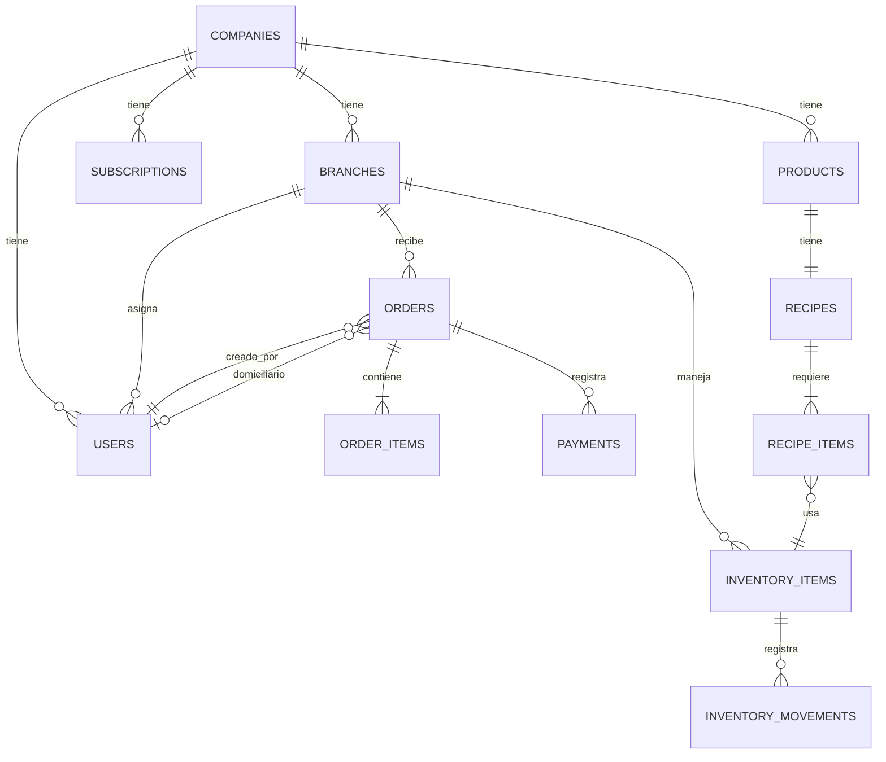

# FastOps – Documento de Requisitos y Desarrollo V3.0

**Versión:** 3.0 - Sistema Asíncrono, Escalable y Preparado para IA  
**Fecha:** Diciembre 2024  
**Autor:** Jhon (cliente) / Equipo de desarrollo  
**Estado:** Arquitectura definitiva para MVP y evolución futura

---

## 📋 ÍNDICE

1. [Información General del Proyecto](#1-información-general-del-proyecto)
2. [Principios Arquitectónicos Fundamentales](#2-principios-arquitectónicos-fundamentales)
3. [Arquitectura Técnica](#3-arquitectura-técnica)
4. [Modelo de Datos Completo](#4-modelo-de-datos-completo)
5. [Sistema de Alto Rendimiento](#5-sistema-de-alto-rendimiento)
6. [Endpoints API](#6-endpoints-api)
7. [WebSockets y Tiempo Real](#7-websockets-y-tiempo-real)
8. [Seguridad Multi-Tenant](#8-seguridad-multi-tenant)
9. [MVP - Entrega 1 (Sistema Base)](#9-mvp---entrega-1-sistema-base)
10. [Entrega 2 - Mejoras y Optimizaciones](#10-entrega-2---mejoras-y-optimizaciones)
11. [Entrega 3 - IA y Automatización](#11-entrega-3---ia-y-automatización)
12. [Plan de Desarrollo Detallado](#12-plan-de-desarrollo-detallado)
13. [Criterios de Calidad y Aceptación](#13-criterios-de-calidad-y-aceptación)
14. [Infraestructura y Escalamiento](#14-infraestructura-y-escalamiento)

---

## 1. INFORMACIÓN GENERAL DEL PROYECTO

### 1.1 Objetivo del Sistema

**FastOps** es una plataforma SaaS multi-tenant para la gestión integral de salchipapererías y negocios de comida rápida, diseñada desde el inicio para:

- **Alta concurrencia:** Manejar múltiples pedidos simultáneos sin bloqueos
- **Escalabilidad:** Crecer de 1 a 1000+ negocios sin rediseño
- **Procesamiento asíncrono:** Operaciones críticas sin tiempos de espera
- **Preparada para IA:** Arquitectura extensible para incorporar asistentes inteligentes

### 1.2 Modelo de Negocio

**Plataforma SaaS con suscripción mensual:**

| Plan | Precio/mes | Sucursales | Usuarios | Productos |
|------|------------|------------|----------|-----------|
| **Trial** | $0 | 1 | 3 | 50 |
| **Basic** | $40.000 COP | 1 | 5 | 200 |
| **Premium** | $80.000 COP | Ilimitadas | Ilimitados | Ilimitados |
| **Enterprise** | A consultar | Ilimitadas | Ilimitados | + IA + Soporte 24/7 |

### 1.3 Usuarios del Sistema

#### Clientes Finales (PWA Pública)
- Acceso vía QR code en mesas/publicidad
- Realizar pedidos sin registrarse
- Ver menú interactivo
- Seguimiento de pedido en tiempo real

#### Personal del Negocio (PWA Administrativa)
- **Administrador:** Control total, reportes, configuración
- **Cajero:** Crear pedidos, recibir pagos, cierre de caja
- **Cocina:** Ver comandas, actualizar estados
- **Domiciliario:** App nativa - recibir pedidos, GPS, confirmar entrega

#### Super Admin (Panel Administrativo)
- Gestión de negocios registrados
- Monitoreo de suscripciones
- Soporte técnico
- Análisis de performance

---

## 2. PRINCIPIOS ARQUITECTÓNICOS FUNDAMENTALES

### 2.1 Principios No Negociables

#### ✅ **ASINCRONÍA OBLIGATORIA**
- **NINGUNA** operación debe bloquear el flujo principal
- Respuesta al usuario siempre < 1 segundo
- Procesamiento en segundo plano con workers
- Cola de tareas con prioridades

#### ✅ **CERO BLOQUEOS**
- Sistema debe funcionar bajo alta carga (100+ pedidos/minuto)
- Manejo de concurrencia con locks optimistas
- Circuit breakers para prevenir cascadas de fallos
- Fallbacks automáticos en operaciones críticas

#### ✅ **ESCALABILIDAD HORIZONTAL**
- Arquitectura stateless (sin sesiones en memoria)
- Base de datos optimizada para multi-tenant
- Workers escalables independientemente
- CDN para contenido estático

#### ✅ **EXTENSIBILIDAD FUTURA**
- Arquitectura preparada para:
  - Módulos de IA (chatbots, predicciones, recomendaciones)
  - Integraciones con terceros (WhatsApp Business, Stripe, etc.)
  - Análisis avanzado con ML
  - API pública para desarrolladores

#### ✅ **RESILIENCIA**
- Degradación elegante ante fallos
- Retry automático con backoff exponencial
- Logging estructurado para debugging
- Monitoreo proactivo con alertas

### 2.2 Arquitectura de Referencia

```
┌─────────────────────────────────────────────────────────┐
│                    CAPA DE CLIENTES                     │
├─────────────────────────────────────────────────────────┤
│  PWA Cliente    │  PWA Admin   │  App Domiciliario     │
│  (React TS)     │  (React TS)  │  (React Native)       │
└────────┬────────┴──────┬───────┴──────────┬────────────┘
         │               │                   │
         └───────────────┼───────────────────┘
                         │
         ┌───────────────▼────────────────┐
         │      API GATEWAY (FastAPI)      │
         │  - Rate Limiting                │
         │  - JWT Validation               │
         │  - Multi-Tenant Middleware      │
         └───────────────┬────────────────┘
                         │
         ┌───────────────┴────────────────┐
         │                                │
    ┌────▼─────┐                  ┌──────▼──────┐
    │ REST API │                  │  WebSockets │
    │ Endpoints│                  │  (Socket.IO)│
    └────┬─────┘                  └──────┬──────┘
         │                               │
         └───────────┬───────────────────┘
                     │
    ┌────────────────▼─────────────────┐
    │      CAPA DE SERVICIOS           │
    │  - OrderService (async)          │
    │  - InventoryService (async)      │
    │  - PrintService (queue)          │
    │  - NotificationService (queue)   │
    └────────────────┬─────────────────┘
                     │
    ┌────────────────┴─────────────────┐
    │                                  │
┌───▼────┐  ┌────────┐  ┌───────────┐
│ Redis  │  │ RabbitMQ│  │PostgreSQL │
│ Cache  │  │ Queues  │  │Multi-Tenant│
└────────┘  └────────┘  └───────────┘
```

---

## 3. ARQUITECTURA TÉCNICA

### 3.1 Stack Tecnológico Definitivo

#### Backend
```yaml
Framework: FastAPI 0.104+
ORM: SQLModel 0.0.14+
Database: PostgreSQL 15+
Cache: Redis 7+
Queue: Redis + Celery (o RQ para MVP)
Auth: JWT (python-jose)
WebSockets: python-socketio
Validation: Pydantic v2
Testing: pytest + pytest-asyncio
```

#### Frontend
```yaml
Framework: React 18+ con TypeScript
State Management: Redux Toolkit + RTK Query
UI: TailwindCSS + shadcn/ui
Forms: React Hook Form + Zod
PWA: Workbox
Build: Vite
Testing: Vitest + React Testing Library
```

#### App Móvil (Domiciliarios)
```yaml
Framework: React Native (Expo)
State: Redux Toolkit
Maps: react-native-maps
GPS: expo-location
Networking: Axios + Socket.IO Client
```

#### Infraestructura
```yaml
Backend Hosting: VPS (Contabo/Hetzner/DigitalOcean)
Frontend Hosting: Vercel/Cloudflare Pages
Database: PostgreSQL en VPS o RDS
Cache/Queue: Redis en VPS o Upstash
CDN: Cloudflare
Monitoring: Sentry + Custom Dashboard
CI/CD: GitHub Actions
```

### 3.2 Patrones de Diseño Implementados

#### Repository Pattern
```python
# Separación clara de acceso a datos
class OrderRepository:
    async def create(self, order: OrderCreate) -> Order
    async def get_by_id(self, order_id: int) -> Order | None
    async def list_by_branch(self, branch_id: int) -> list[Order]
```

#### Service Layer Pattern
```python
# Lógica de negocio centralizada
class OrderService:
    def __init__(self, repo: OrderRepository, queue: TaskQueue):
        self.repo = repo
        self.queue = queue
    
    async def create_order(self, order: OrderCreate) -> OrderResponse:
        # 1. Validar y crear en BD
        # 2. Encolar impresión
        # 3. Notificar WebSocket
        # 4. Retornar inmediatamente
```

#### Circuit Breaker Pattern
```python
# Prevenir cascadas de fallos
@circuit_breaker(failure_threshold=5, timeout=60)
async def print_order(order_id: int):
    # Intenta imprimir, si falla mucho, usa fallback
```

#### CQRS (Command Query Responsibility Segregation)
```python
# Separar escrituras de lecturas
class OrderCommands:
    async def create_order(...)  # Escribe
    
class OrderQueries:
    async def get_order(...)     # Lee (puede usar cache)
```

---

## 4. MODELO DE DATOS COMPLETO

### 4.1 Diagrama Entidad-Relación (Multi-Tenant)



### 4.2 Tablas Multi-Tenant Core

#### `companies`
```sql
CREATE TABLE companies (
    id SERIAL PRIMARY KEY,
    name VARCHAR(200) NOT NULL,
    slug VARCHAR(100) UNIQUE NOT NULL,
    legal_name VARCHAR(200),
    tax_id VARCHAR(50),
    owner_name VARCHAR(200) NOT NULL,
    owner_email VARCHAR(200) UNIQUE NOT NULL,
    owner_phone VARCHAR(50),
    plan VARCHAR(20) NOT NULL DEFAULT 'trial',
    is_active BOOLEAN NOT NULL DEFAULT true,
    trial_ends_at TIMESTAMP,
    timezone VARCHAR(50) DEFAULT 'America/Bogota',
    currency VARCHAR(3) DEFAULT 'COP',
    max_users INTEGER,
    max_branches INTEGER,
    max_products INTEGER,
    created_at TIMESTAMP DEFAULT NOW(),
    updated_at TIMESTAMP DEFAULT NOW(),
    deleted_at TIMESTAMP
);

CREATE INDEX idx_companies_slug ON companies(slug);
CREATE INDEX idx_companies_active ON companies(is_active);
```

#### `branches`
```sql
CREATE TABLE branches (
    id SERIAL PRIMARY KEY,
    company_id INTEGER NOT NULL REFERENCES companies(id),
    name VARCHAR(200) NOT NULL,
    code VARCHAR(20) NOT NULL,
    address TEXT,
    phone VARCHAR(50),
    latitude NUMERIC(10,8),
    longitude NUMERIC(11,8),
    is_active BOOLEAN DEFAULT true,
    is_main BOOLEAN DEFAULT false,
    created_at TIMESTAMP DEFAULT NOW(),
    updated_at TIMESTAMP DEFAULT NOW(),
    
    UNIQUE(company_id, code)
);

CREATE INDEX idx_branches_company ON branches(company_id);
CREATE INDEX idx_branches_active ON branches(company_id, is_active);
```

#### `subscriptions`
```sql
CREATE TABLE subscriptions (
    id SERIAL PRIMARY KEY,
    company_id INTEGER NOT NULL REFERENCES companies(id),
    plan VARCHAR(20) NOT NULL,
    status VARCHAR(20) NOT NULL,
    started_at TIMESTAMP NOT NULL,
    current_period_start TIMESTAMP NOT NULL,
    current_period_end TIMESTAMP NOT NULL,
    cancelled_at TIMESTAMP,
    amount NUMERIC(12,2) NOT NULL,
    currency VARCHAR(3) DEFAULT 'COP',
    stripe_subscription_id VARCHAR(100),
    wompi_subscription_id VARCHAR(100),
    created_at TIMESTAMP DEFAULT NOW(),
    updated_at TIMESTAMP DEFAULT NOW()
);

CREATE INDEX idx_subscriptions_company ON subscriptions(company_id);
CREATE INDEX idx_subscriptions_status ON subscriptions(status, current_period_end);
```

#### `order_counters`
```sql
CREATE TABLE order_counters (
    id SERIAL PRIMARY KEY,
    company_id INTEGER NOT NULL REFERENCES companies(id),
    branch_id INTEGER NOT NULL REFERENCES branches(id),
    order_type VARCHAR(20) NOT NULL,
    last_number INTEGER NOT NULL DEFAULT 0,
    
    UNIQUE(company_id, branch_id, order_type)
);

CREATE INDEX idx_order_counters ON order_counters(company_id, branch_id, order_type);
```

### 4.3 Tablas de Negocio (con Multi-Tenant)

#### `users`
```sql
CREATE TABLE users (
    id SERIAL PRIMARY KEY,
    company_id INTEGER NOT NULL REFERENCES companies(id),
    branch_id INTEGER REFERENCES branches(id),
    username VARCHAR(100) NOT NULL,
    email VARCHAR(200),
    full_name VARCHAR(200) NOT NULL,
    password_hash VARCHAR(255) NOT NULL,
    role VARCHAR(20) NOT NULL,
    is_active BOOLEAN DEFAULT true,
    created_at TIMESTAMP DEFAULT NOW(),
    updated_at TIMESTAMP DEFAULT NOW(),
    last_login TIMESTAMP,
    
    UNIQUE(company_id, username)
);

CREATE INDEX idx_users_company ON users(company_id);
CREATE INDEX idx_users_branch ON users(branch_id);
CREATE INDEX idx_users_login ON users(company_id, username, is_active);
```

#### `categories`
```sql
CREATE TABLE categories (
    id SERIAL PRIMARY KEY,
    company_id INTEGER NOT NULL REFERENCES companies(id),
    name VARCHAR(200) NOT NULL,
    is_active BOOLEAN DEFAULT true,
    created_at TIMESTAMP DEFAULT NOW(),
    
    UNIQUE(company_id, name)
);

CREATE INDEX idx_categories_company ON categories(company_id);
```

#### `products`
```sql
CREATE TABLE products (
    id SERIAL PRIMARY KEY,
    company_id INTEGER NOT NULL REFERENCES companies(id),
    category_id INTEGER REFERENCES categories(id),
    name VARCHAR(200) NOT NULL,
    description TEXT,
    price NUMERIC(12,2) NOT NULL,
    image_url VARCHAR(500),
    is_active BOOLEAN DEFAULT true,
    created_at TIMESTAMP DEFAULT NOW(),
    updated_at TIMESTAMP DEFAULT NOW()
);

CREATE INDEX idx_products_company ON products(company_id);
CREATE INDEX idx_products_category ON products(company_id, category_id);
CREATE INDEX idx_products_active ON products(company_id, is_active);
```

#### `inventory_items`
```sql
CREATE TABLE inventory_items (
    id SERIAL PRIMARY KEY,
    company_id INTEGER NOT NULL REFERENCES companies(id),
    branch_id INTEGER REFERENCES branches(id),
    name VARCHAR(200) NOT NULL,
    unit_of_measure VARCHAR(50) NOT NULL,
    current_stock NUMERIC(12,4) NOT NULL DEFAULT 0,
    min_stock NUMERIC(12,4),
    average_cost NUMERIC(12,4),
    is_active BOOLEAN DEFAULT true,
    created_at TIMESTAMP DEFAULT NOW()
);

CREATE INDEX idx_inventory_company ON inventory_items(company_id);
CREATE INDEX idx_inventory_branch ON inventory_items(branch_id);
CREATE INDEX idx_inventory_stock ON inventory_items(company_id, current_stock, min_stock);
```

#### `recipes`
```sql
CREATE TABLE recipes (
    id SERIAL PRIMARY KEY,
    company_id INTEGER NOT NULL REFERENCES companies(id),
    product_id INTEGER NOT NULL REFERENCES products(id),
    description TEXT,
    created_at TIMESTAMP DEFAULT NOW(),
    
    UNIQUE(product_id)
);
```

#### `recipe_items`
```sql
CREATE TABLE recipe_items (
    id SERIAL PRIMARY KEY,
    recipe_id INTEGER NOT NULL REFERENCES recipes(id),
    inventory_item_id INTEGER NOT NULL REFERENCES inventory_items(id),
    quantity NUMERIC(12,4) NOT NULL
);
```

#### `orders`
```sql
CREATE TABLE orders (
    id SERIAL PRIMARY KEY,
    company_id INTEGER NOT NULL REFERENCES companies(id),
    branch_id INTEGER NOT NULL REFERENCES branches(id),
    consecutive VARCHAR(50) NOT NULL,
    order_type VARCHAR(20) NOT NULL,
    table_number VARCHAR(20),
    customer_name VARCHAR(200),
    customer_phone VARCHAR(50),
    delivery_address TEXT,
    status VARCHAR(20) NOT NULL DEFAULT 'pending',
    total NUMERIC(12,2) NOT NULL,
    delivery_person_id INTEGER REFERENCES users(id),
    created_by INTEGER NOT NULL REFERENCES users(id),
    created_at TIMESTAMP DEFAULT NOW(),
    updated_at TIMESTAMP DEFAULT NOW(),
    
    UNIQUE(company_id, consecutive)
);

CREATE INDEX idx_orders_company_branch ON orders(company_id, branch_id);
CREATE INDEX idx_orders_status ON orders(company_id, status, created_at);
CREATE INDEX idx_orders_consecutive ON orders(company_id, consecutive);
CREATE INDEX idx_orders_delivery ON orders(delivery_person_id, status);
```

#### `order_items`
```sql
CREATE TABLE order_items (
    id SERIAL PRIMARY KEY,
    order_id INTEGER NOT NULL REFERENCES orders(id),
    product_id INTEGER NOT NULL REFERENCES products(id),
    quantity INTEGER NOT NULL,
    unit_price NUMERIC(12,2) NOT NULL,
    subtotal NUMERIC(12,2) NOT NULL
);
```

#### `payments`
```sql
CREATE TABLE payments (
    id SERIAL PRIMARY KEY,
    order_id INTEGER NOT NULL REFERENCES orders(id),
    payment_method VARCHAR(20) NOT NULL,
    amount NUMERIC(12,2) NOT NULL,
    reference VARCHAR(200),
    created_at TIMESTAMP DEFAULT NOW()
);
```

#### `cash_closures`
```sql
CREATE TABLE cash_closures (
    id SERIAL PRIMARY KEY,
    company_id INTEGER NOT NULL REFERENCES companies(id),
    branch_id INTEGER NOT NULL REFERENCES branches(id),
    user_id INTEGER NOT NULL REFERENCES users(id),
    expected_total NUMERIC(12,2) NOT NULL,
    actual_total NUMERIC(12,2) NOT NULL,
    difference NUMERIC(12,2) NOT NULL,
    notes TEXT,
    created_at TIMESTAMP DEFAULT NOW()
);

CREATE INDEX idx_closures_company_branch ON cash_closures(company_id, branch_id);
CREATE INDEX idx_closures_date ON cash_closures(company_id, created_at);
```

#### `inventory_movements`
```sql
CREATE TABLE inventory_movements (
    id SERIAL PRIMARY KEY,
    company_id INTEGER NOT NULL REFERENCES companies(id),
    branch_id INTEGER NOT NULL REFERENCES branches(id),
    inventory_item_id INTEGER NOT NULL REFERENCES inventory_items(id),
    movement_type VARCHAR(20) NOT NULL,
    quantity NUMERIC(12,4) NOT NULL,
    unit_cost NUMERIC(12,4),
    reason VARCHAR(200),
    reference VARCHAR(200),
    user_id INTEGER NOT NULL REFERENCES users(id),
    created_at TIMESTAMP DEFAULT NOW()
);

CREATE INDEX idx_movements_company_branch ON inventory_movements(company_id, branch_id);
CREATE INDEX idx_movements_date ON inventory_movements(company_id, created_at);
```

### 4.4 Tablas de Sistema de Impresión (NUEVO)

#### `print_queue`
```sql
CREATE TABLE print_queue (
    id SERIAL PRIMARY KEY,
    company_id INTEGER NOT NULL REFERENCES companies(id),
    branch_id INTEGER NOT NULL REFERENCES branches(id),
    order_id INTEGER NOT NULL REFERENCES orders(id),
    priority VARCHAR(20) NOT NULL DEFAULT 'normal',
    status VARCHAR(20) NOT NULL DEFAULT 'pending',
    attempts INTEGER DEFAULT 0,
    max_attempts INTEGER DEFAULT 3,
    printer_id VARCHAR(50),
    payload JSONB NOT NULL,
    error_message TEXT,
    created_at TIMESTAMP DEFAULT NOW(),
    processed_at TIMESTAMP,
    completed_at TIMESTAMP
);

CREATE INDEX idx_print_queue_status ON print_queue(company_id, branch_id, status, priority);
CREATE INDEX idx_print_queue_created ON print_queue(created_at);
```

### 4.5 Tablas de Auditoría y Logs

#### `audit_logs`
```sql
CREATE TABLE audit_logs (
    id SERIAL PRIMARY KEY,
    company_id INTEGER NOT NULL REFERENCES companies(id),
    branch_id INTEGER REFERENCES branches(id),
    user_id INTEGER REFERENCES users(id),
    action VARCHAR(100) NOT NULL,
    entity VARCHAR(100) NOT NULL,
    entity_id INTEGER,
    details JSONB,
    ip_address VARCHAR(50),
    user_agent TEXT,
    created_at TIMESTAMP DEFAULT NOW()
);

CREATE INDEX idx_logs_company ON audit_logs(company_id, created_at);
CREATE INDEX idx_logs_user ON audit_logs(user_id, created_at);
CREATE INDEX idx_logs_entity ON audit_logs(company_id, entity, entity_id);
```

---

## 5. SISTEMA DE ALTO RENDIMIENTO

### 5.1 Cola de Impresión Asíncrona

**Problema resuelto:** Sistema anterior tardaba 30 minutos en imprimir comandas en días de alta carga.

**Solución arquitectural:**

```
Cliente → Backend (< 1s) → Redis Queue → Workers (3-10) → Impresoras
              ↓
         Respuesta inmediata
```

#### Implementación con Celery

```python
# backend/app/tasks/printing.py
from celery import Celery
from app.services.printer import PrinterService

celery_app = Celery('fastops', broker='redis://localhost:6379/0')

@celery_app.task(
    bind=True,
    max_retries=3,
    default_retry_delay=2
)
def print_order_task(self, order_id: int, company_id: int, branch_id: int):
    """
    Task asíncrona para imprimir comanda
    """
    try:
        printer_service = PrinterService()
        result = printer_service.print_order(
            order_id=order_id,
            company_id=company_id,
            branch_id=branch_id
        )
        return result
        
    except Exception as exc:
        # Reintentar automáticamente
        raise self.retry(exc=exc)
```

#### Endpoint de creación de pedido (NO bloqueante)

```python
# backend/app/routers/orders.py
@router.post("/orders")
async def create_order(
    order: OrderCreate,
    current_user: User = Depends(get_current_user),
    db: AsyncSession = Depends(get_db)
):
    """
    Crear pedido - Respuesta < 1 segundo garantizada
    """
    # 1. Crear pedido en BD (300-500ms)
    created_order = await order_service.create(order, db)
    
    # 2. Encolar impresión (100ms) - NO BLOQUEANTE
    print_order_task.delay(
        order_id=created_order.id,
        company_id=current_user.company_id,
        branch_id=current_user.branch_id
    )
    
    # 3. Notificar por WebSocket (50ms)
    await socketio.emit(
        'newOrder',
        created_order.dict(),
        room=f"kitchen_{current_user.company_id}_{current_user.branch_id}"
    )
    
    # 4. RESPUESTA INMEDIATA (total < 1s)
    return {
        "id": created_order.id,
        "consecutive": created_order.consecutive,
        "status": "received",
        "print_status": "queued",
        "estimated_print_time": "5-10 segundos"
    }
```

### 5.2 Workers Escalables

**Configuración dinámica:**

```python
# backend/app/workers/config.py
class WorkerConfig:
    MIN_WORKERS = 2
    MAX_WORKERS = 10
    SCALE_UP_THRESHOLD = 15    # pedidos en cola
    SCALE_DOWN_THRESHOLD = 5
    
    # Auto-scaling rules
    @classmethod
    def calculate_workers(cls, queue_size: int) -> int:
        if queue_size > cls.SCALE_UP_THRESHOLD:
            return min(cls.MAX_WORKERS, queue_size // 5)
        elif queue_size < cls.SCALE_DOWN_THRESHOLD:
            return cls.MIN_WORKERS
        return None  # No cambiar
```

**Comando para iniciar workers:**

```bash
# Desarrollo (2 workers)
celery -A app.tasks.celery_app worker --loglevel=info --concurrency=2

# Producción (auto-scale 2-10 workers)
celery -A app.tasks.celery_app worker \
  --loglevel=info \
  --autoscale=10,2 \
  --max-tasks-per-child=100
```

### 5.3 Circuit Breaker para Impresoras

```python
# backend/app/core/circuit_breaker.py
from enum import Enum
from datetime import datetime, timedelta

class CircuitState(Enum):
    CLOSED = "closed"      # Normal
    OPEN = "open"          # Impresora caída
    HALF_OPEN = "half_open"  # Probando

class CircuitBreaker:
    def __init__(self, failure_threshold=5, timeout=60):
        self.state = CircuitState.CLOSED
        self.failures = 0
        self.failure_threshold = failure_threshold
        self.timeout = timeout
        self.last_failure_time = None
    
    async def call(self, func, *args, **kwargs):
        if self.state == CircuitState.OPEN:
            if self._should_attempt_reset():
                self.state = CircuitState.HALF_OPEN
            else:
                raise CircuitBreakerOpen("Printer unavailable")
        
        try:
            result = await func(*args, **kwargs)
            self._on_success()
            return result
        except Exception as e:
            self._on_failure()
            raise e
    
    def _on_success(self):
        self.failures = 0
        if self.state == CircuitState.HALF_OPEN:
            self.state = CircuitState.CLOSED
    
    def _on_failure(self):
        self.failures += 1
        self.last_failure_time = datetime.now()
        
        if self.failures >= self.failure_threshold:
            self.state = CircuitState.OPEN
            # Activar fallback automático
            self._activate_fallback()
```

### 5.4 Sistema de Fallback

```python
# backend/app/services/print_fallback.py
class PrintFallbackService:
    """
    Métodos alternativos cuando la impresora falla
    """
    
    async def display_on_kitchen_screen(self, order_data: dict):
        """Mostrar pedido en pantalla de cocina"""
        await socketio.emit(
            'print_fallback',
            {
                'order': order_data,
                'message': 'Imprimir manualmente',
                'alert': True
            },
            room=f"kitchen_{order_data['company_id']}_{order_data['branch_id']}"
        )
    
    async def generate_pdf_backup(self, order_data: dict) -> str:
        """Generar PDF de respaldo"""
        pdf_path = await PDFGenerator.create_order_pdf(order_data)
        return pdf_path
    
    async def send_email_emergency(self, order_data: dict, recipient: str):
        """Enviar email de emergencia"""
        await EmailService.send(
            to=recipient,
            subject=f"URGENTE: Pedido {order_data['consecutive']}",
            body=f"Impresora caída. Pedido: {json.dumps(order_data, indent=2)}"
        )
    
    async def notify_admin(self, company_id: int, message: str):
        """Alertar al administrador"""
        await socketio.emit(
            'system_alert',
            {
                'type': 'printer_failure',
                'message': message,
                'timestamp': datetime.now().isoformat()
            },
            room=f"admin_{company_id}"
        )
```

### 5.5 Monitoreo de Performance en Tiempo Real

```python
# backend/app/routers/monitoring.py
@router.get("/admin/performance/dashboard")
async def performance_dashboard(
    current_user: User = Depends(require_admin),
    db: AsyncSession = Depends(get_db)
):
    """Dashboard de performance en tiempo real"""
    
    # Estado de la cola de impresión
    queue_stats = await get_queue_statistics(
        company_id=current_user.company_id,
        db=db
    )
    
    # Workers activos
    celery_inspect = celery_app.control.inspect()
    active_workers = len(celery_inspect.active() or {})
    
    # Tiempo promedio de procesamiento
    avg_time = await calculate_avg_processing_time(
        company_id=current_user.company_id,
        last_hours=1,
        db=db
    )
    
    # Circuit breakers status
    circuit_status = {
        printer_id: {
            'state': cb.state.value,
            'failures': cb.failures,
            'last_failure': cb.last_failure_time.isoformat() if cb.last_failure_time else None
        }
        for printer_id, cb in circuit_breakers.items()
    }
    
    return {
        "queue": queue_stats,
        "workers": {
            "active": active_workers,
            "target": WorkerConfig.MIN_WORKERS
        },
        "performance": {
            "avg_processing_time_seconds": round(avg_time, 2),
            "target_seconds": 5.0,
            "status": "good" if avg_time < 10 else "warning"
        },
        "circuit_breakers": circuit_status,
        "alerts": await get_active_alerts(current_user.company_id)
    }
```

---

## 6. ENDPOINTS API

### 6.1 Autenticación y Autorización

```
POST   /api/v1/auth/register                # Registro nuevo negocio (self-service)
POST   /api/v1/auth/login                   # Login (JWT con company_id y branch_id)
POST   /api/v1/auth/refresh                 # Renovar token
GET    /api/v1/auth/me                      # Datos del usuario actual
POST   /api/v1/auth/switch-branch           # Cambiar sucursal (admins)
POST   /api/v1/auth/logout                  # Cerrar sesión
POST   /api/v1/auth/forgot-password         # Recuperar contraseña
POST   /api/v1/auth/reset-password          # Resetear contraseña
```

### 6.2 Gestión de Negocios (Super Admin)

```
GET    /api/v1/admin/companies              # Listar todos los negocios
POST   /api/v1/admin/companies              # Crear negocio manualmente
GET    /api/v1/admin/companies/{id}         # Detalle de negocio
PUT    /api/v1/admin/companies/{id}         # Actualizar negocio
DELETE /api/v1/admin/companies/{id}         # Desactivar negocio
POST   /api/v1/admin/companies/{id}/activate # Reactivar negocio
GET    /api/v1/admin/companies/{id}/stats   # Estadísticas del negocio
```

### 6.3 Gestión de Sucursales

```
GET    /api/v1/branches                     # Listar sucursales del negocio
POST   /api/v1/branches                     # Crear nueva sucursal
GET    /api/v1/branches/{id}                # Detalle de sucursal
PUT    /api/v1/branches/{id}                # Actualizar sucursal
DELETE /api/v1/branches/{id}                # Eliminar sucursal
GET    /api/v1/branches/{id}/stats          # Estadísticas de sucursal
```

### 6.4 Suscripciones

```
GET    /api/v1/subscriptions/current        # Suscripción actual
GET    /api/v1/subscriptions/plans          # Planes disponibles
POST   /api/v1/subscriptions/upgrade        # Cambiar a plan superior
POST   /api/v1/subscriptions/downgrade      # Cambiar a plan inferior
POST   /api/v1/subscriptions/cancel         # Cancelar suscripción
GET    /api/v1/subscriptions/invoices       # Historial de facturas
POST   /api/v1/subscriptions/payment-method # Actualizar método de pago
```

### 6.5 Productos y Catálogo

```
GET    /api/v1/products                     # Listar productos
POST   /api/v1/products                     # Crear producto
GET    /api/v1/products/{id}                # Detalle de producto
PUT    /api/v1/products/{id}                # Actualizar producto
DELETE /api/v1/products/{id}                # Eliminar producto
POST   /api/v1/products/{id}/recipe         # Crear/actualizar receta
GET    /api/v1/products/{id}/recipe         # Ver receta
POST   /api/v1/products/bulk-import         # Importación masiva
```

### 6.6 Categorías

```
GET    /api/v1/categories                   # Listar categorías
POST   /api/v1/categories                   # Crear categoría
PUT    /api/v1/categories/{id}              # Actualizar categoría
DELETE /api/v1/categories/{id}              # Eliminar categoría
```

### 6.7 Pedidos (Asíncronos)

```
POST   /api/v1/orders                       # Crear pedido (< 1s respuesta)
GET    /api/v1/orders                       # Listar pedidos
GET    /api/v1/orders/{id}                  # Detalle de pedido
PATCH  /api/v1/orders/{id}/status           # Cambiar estado
POST   /api/v1/orders/{id}/assign           # Asignar domiciliario
POST   /api/v1/orders/{id}/cancel           # Cancelar pedido
POST   /api/v1/orders/{id}/reprint          # Reenviar a cola de impresión
GET    /api/v1/orders/stats                 # Estadísticas de pedidos
```

### 6.8 Cocina

```
GET    /api/v1/kitchen/orders               # Pedidos por preparar
POST   /api/v1/kitchen/orders/{id}/start    # Iniciar preparación
POST   /api/v1/kitchen/orders/{id}/ready    # Marcar como listo
GET    /api/v1/kitchen/stats                # Estadísticas de cocina
```

### 6.9 Inventario

```
GET    /api/v1/inventory                    # Listar inventario
POST   /api/v1/inventory/items              # Crear insumo
PUT    /api/v1/inventory/items/{id}         # Actualizar insumo
DELETE /api/v1/inventory/items/{id}         # Eliminar insumo
POST   /api/v1/inventory/movements          # Registrar movimiento
GET    /api/v1/inventory/movements          # Historial de movimientos
GET    /api/v1/inventory/low-stock          # Alertas de stock bajo
POST   /api/v1/inventory/bulk-import        # Importación masiva
GET    /api/v1/inventory/report             # Reporte de inventario
```

### 6.10 Domiciliarios

```
POST   /api/v1/delivery/login               # Login domiciliario
GET    /api/v1/delivery/me                  # Datos del domiciliario
GET    /api/v1/delivery/assigned            # Pedidos asignados
POST   /api/v1/delivery/{id}/location       # Actualizar ubicación GPS
POST   /api/v1/delivery/{id}/accept         # Aceptar pedido
POST   /api/v1/delivery/{id}/pickup         # Recoger pedido
POST   /api/v1/delivery/{id}/deliver        # Marcar entrega
POST   /api/v1/delivery/{id}/issue          # Reportar problema
GET    /api/v1/delivery/stats               # Estadísticas del domiciliario
```

### 6.11 Caja y Pagos

```
POST   /api/v1/payments                     # Registrar pago
GET    /api/v1/payments/{order_id}          # Ver pagos de un pedido
POST   /api/v1/cash/close                   # Cierre de caja
GET    /api/v1/cash/closures                # Historial de cierres
GET    /api/v1/cash/current-shift           # Turno actual
```

### 6.12 Reportes

```
GET    /api/v1/reports/daily                # Reporte diario
GET    /api/v1/reports/weekly               # Reporte semanal
GET    /api/v1/reports/monthly              # Reporte mensual
GET    /api/v1/reports/sales                # Reporte de ventas
GET    /api/v1/reports/products             # Productos más vendidos
GET    /api/v1/reports/inventory            # Reporte de inventario
GET    /api/v1/reports/delivery-persons     # Reporte de domiciliarios
GET    /api/v1/reports/consolidated         # Reporte consolidado (todas las sucursales)
POST   /api/v1/reports/custom               # Reporte personalizado
GET    /api/v1/reports/export/{format}      # Exportar (PDF/Excel/CSV)
```

### 6.13 Monitoreo y Performance

```
GET    /api/v1/monitoring/health            # Health check
GET    /api/v1/monitoring/performance       # Dashboard de performance
GET    /api/v1/monitoring/queue-status      # Estado de la cola
POST   /api/v1/monitoring/scale-workers     # Escalar workers manualmente
GET    /api/v1/monitoring/alerts            # Alertas activas
POST   /api/v1/monitoring/clear-cache       # Limpiar cache
```

### 6.14 Configuración

```
GET    /api/v1/settings                     # Configuración del negocio
PUT    /api/v1/settings                     # Actualizar configuración
GET    /api/v1/settings/printers            # Configuración de impresoras
PUT    /api/v1/settings/printers            # Actualizar impresoras
```

---

## 7. WEBSOCKETS Y TIEMPO REAL

### 7.1 Arquitectura de WebSockets

**Implementación con Socket.IO:**

```python
# backend/app/core/websockets.py
from socketio import AsyncServer
import socketio

# Configuración optimizada
sio = AsyncServer(
    async_mode='asgi',
    cors_allowed_origins='*',
    ping_timeout=60,
    ping_interval=25,
    compression_threshold=1024,
    logger=False,
    engineio_logger=False
)

# Rooms por negocio y sucursal
@sio.event
async def connect(sid, environ, auth):
    """Conexión de cliente"""
    user_data = await verify_jwt_token(auth.get('token'))
    
    # Guardar datos del usuario en sesión
    await sio.save_session(sid, {
        'user_id': user_data['user_id'],
        'company_id': user_data['company_id'],
        'branch_id': user_data['branch_id'],
        'role': user_data['role']
    })
    
    # Unir a rooms correspondientes
    await join_user_rooms(sid, user_data)

async def join_user_rooms(sid: str, user_data: dict):
    """Unir usuario a sus rooms correspondientes"""
    company_id = user_data['company_id']
    branch_id = user_data['branch_id']
    role = user_data['role']
    
    # Room principal de la empresa
    sio.enter_room(sid, f"company_{company_id}")
    
    # Room de la sucursal
    if branch_id:
        sio.enter_room(sid, f"branch_{company_id}_{branch_id}")
    
    # Rooms específicos por rol
    if role == 'kitchen':
        sio.enter_room(sid, f"kitchen_{company_id}_{branch_id}")
    
    elif role == 'cashier':
        sio.enter_room(sid, f"cashier_{company_id}_{branch_id}")
    
    elif role == 'delivery':
        sio.enter_room(sid, f"delivery_{user_data['user_id']}")
    
    elif role == 'admin':
        sio.enter_room(sid, f"admin_{company_id}")
```

### 7.2 Eventos del Sistema

#### Eventos de Pedidos

```python
# Nuevo pedido creado
await sio.emit(
    'order:created',
    {
        'order_id': order.id,
        'consecutive': order.consecutive,
        'type': order.order_type,
        'total': float(order.total),
        'items': order.items
    },
    room=f"kitchen_{order.company_id}_{order.branch_id}"
)

# Cambio de estado
await sio.emit(
    'order:status_changed',
    {
        'order_id': order.id,
        'old_status': old_status,
        'new_status': new_status,
        'timestamp': datetime.now().isoformat()
    },
    room=f"branch_{order.company_id}_{order.branch_id}"
)

# Pedido listo
await sio.emit(
    'order:ready',
    {
        'order_id': order.id,
        'consecutive': order.consecutive
    },
    room=f"cashier_{order.company_id}_{order.branch_id}"
)
```

#### Eventos de Impresión

```python
# Pedido en cola de impresión
await sio.emit(
    'print:queued',
    {
        'order_id': order.id,
        'position': queue_position,
        'estimated_time': estimated_seconds
    },
    room=f"cashier_{order.company_id}_{order.branch_id}"
)

# Pedido impreso exitosamente
await sio.emit(
    'print:completed',
    {
        'order_id': order.id,
        'success': True
    },
    room=f"kitchen_{order.company_id}_{order.branch_id}"
)

# Fallo en impresión (usando fallback)
await sio.emit(
    'print:fallback',
    {
        'order_id': order.id,
        'message': 'Imprimir manualmente',
        'order_data': order_payload
    },
    room=f"kitchen_{order.company_id}_{order.branch_id}"
)
```

#### Eventos de Domiciliarios

```python
# Pedido asignado
await sio.emit(
    'delivery:assigned',
    {
        'order_id': order.id,
        'order_details': order_data,
        'customer': customer_data,
        'delivery_address': address
    },
    room=f"delivery_{delivery_person_id}"
)

# Actualización de ubicación
await sio.emit(
    'delivery:location_update',
    {
        'delivery_person_id': delivery_person_id,
        'order_id': order.id,
        'latitude': lat,
        'longitude': lng,
        'timestamp': datetime.now().isoformat()
    },
    room=f"admin_{company_id}"
)

# Pedido entregado
await sio.emit(
    'delivery:completed',
    {
        'order_id': order.id,
        'delivery_person_id': delivery_person_id,
        'timestamp': datetime.now().isoformat()
    },
    room=f"branch_{company_id}_{branch_id}"
)
```

#### Eventos del Sistema

```python
# Alerta de sistema
await sio.emit(
    'system:alert',
    {
        'type': 'printer_failure',
        'severity': 'high',
        'message': 'Impresora principal fuera de servicio',
        'action_required': True
    },
    room=f"admin_{company_id}"
)

# Stock bajo
await sio.emit(
    'inventory:low_stock',
    {
        'item_id': item.id,
        'item_name': item.name,
        'current_stock': item.current_stock,
        'min_stock': item.min_stock
    },
    room=f"admin_{company_id}"
)
```

---

## 8. SEGURIDAD MULTI-TENANT

### 8.1 Middleware de Verificación

```python
# backend/app/core/multi_tenant.py
from fastapi import Depends, HTTPException, status
from typing import Optional

async def verify_company_access(
    company_id: int,
    current_user: User = Depends(get_current_user)
):
    """
    Verifica que el usuario tenga acceso a la compañía solicitada
    """
    if current_user.company_id != company_id:
        raise HTTPException(
            status_code=status.HTTP_403_FORBIDDEN,
            detail="Access denied to this company"
        )
    return True

async def verify_branch_access(
    branch_id: int,
    current_user: User = Depends(get_current_user),
    db: AsyncSession = Depends(get_db)
):
    """
    Verifica acceso a sucursal específica
    - Admin: puede ver todas las sucursales de su negocio
    - Otros roles: solo su sucursal asignada
    """
    if current_user.role == "admin":
        # Verificar que la sucursal pertenece a su empresa
        branch = await db.execute(
            select(Branch).where(
                Branch.id == branch_id,
                Branch.company_id == current_user.company_id
            )
        )
        branch = branch.scalar_one_or_none()
        
        if not branch:
            raise HTTPException(403, "Branch not found")
        return True
    
    # Otros roles solo su sucursal
    if current_user.branch_id != branch_id:
        raise HTTPException(403, "Access denied to this branch")
    
    return True

async def verify_active_subscription(
    current_user: User = Depends(get_current_user),
    db: AsyncSession = Depends(get_db)
):
    """
    Verifica que la suscripción del negocio esté activa
    """
    subscription = await db.execute(
        select(Subscription).where(
            Subscription.company_id == current_user.company_id,
            Subscription.status == "active",
            Subscription.current_period_end > datetime.utcnow()
        )
    )
    subscription = subscription.scalar_one_or_none()
    
    if not subscription:
        raise HTTPException(
            status_code=status.HTTP_402_PAYMENT_REQUIRED,
            detail="Subscription expired. Please renew your plan."
        )
    
    return True

async def verify_plan_limits(
    current_user: User = Depends(get_current_user),
    db: AsyncSession = Depends(get_db)
):
    """
    Verifica límites del plan actual
    """
    company = await db.get(Company, current_user.company_id)
    
    # Verificar límites según acción
    # (implementar según contexto)
    return company
```

### 8.2 Estructura del JWT

```python
# backend/app/core/security.py
from jose import jwt
from datetime import datetime, timedelta

SECRET_KEY = settings.SECRET_KEY
ALGORITHM = "HS256"
ACCESS_TOKEN_EXPIRE_MINUTES = 30

def create_access_token(data: dict) -> str:
    """
    Crear JWT con información multi-tenant
    """
    to_encode = data.copy()
    expire = datetime.utcnow() + timedelta(minutes=ACCESS_TOKEN_EXPIRE_MINUTES)
    
    to_encode.update({
        "exp": expire,
        "iat": datetime.utcnow(),
        "type": "access"
    })
    
    encoded_jwt = jwt.encode(to_encode, SECRET_KEY, algorithm=ALGORITHM)
    return encoded_jwt

async def create_tokens_for_user(user: User) -> dict:
    """
    Generar tokens completos para usuario
    """
    access_token_data = {
        "sub": str(user.id),
        "company_id": user.company_id,
        "branch_id": user.branch_id,
        "role": user.role,
        "email": user.email
    }
    
    access_token = create_access_token(access_token_data)
    
    return {
        "access_token": access_token,
        "token_type": "bearer",
        "expires_in": ACCESS_TOKEN_EXPIRE_MINUTES * 60
    }
```

### 8.3 Filtros Automáticos en Queries

```python
# backend/app/repositories/base.py
from sqlalchemy.ext.asyncio import AsyncSession
from sqlalchemy import select
from typing import TypeVar, Generic, Optional

ModelType = TypeVar("ModelType")

class BaseRepository(Generic[ModelType]):
    def __init__(self, model: type[ModelType], db: AsyncSession):
        self.model = model
        self.db = db
    
    async def get_by_id(
        self,
        id: int,
        company_id: int
    ) -> Optional[ModelType]:
        """
        Obtener por ID con filtro automático de company_id
        """
        result = await self.db.execute(
            select(self.model).where(
                self.model.id == id,
                self.model.company_id == company_id
            )
        )
        return result.scalar_one_or_none()
    
    async def list(
        self,
        company_id: int,
        branch_id: Optional[int] = None,
        skip: int = 0,
        limit: int = 100
    ) -> list[ModelType]:
        """
        Listar con filtros multi-tenant automáticos
        """
        query = select(self.model).where(
            self.model.company_id == company_id
        )
        
        if branch_id and hasattr(self.model, 'branch_id'):
            query = query.where(self.model.branch_id == branch_id)
        
        query = query.offset(skip).limit(limit)
        
        result = await self.db.execute(query)
        return result.scalars().all()
```

---

## 9. MVP - ENTREGA 1 (SISTEMA BASE)

### 9.1 Objetivo del MVP

**Entregar un sistema funcional, estable y escalable** que permita a un negocio operar completamente sin papel y sin WhatsApp, con garantías de:
- ✅ **Cero bloqueos** bajo carga normal (50 pedidos/hora)
- ✅ **Respuesta < 1 segundo** en operaciones críticas
- ✅ **Alta disponibilidad** (99% uptime)
- ✅ **Preparado para escalar** sin reescritura

### 9.2 Alcance del MVP

#### ✅ Módulos Incluidos

**1. Autenticación y Autorización**
- Registro de negocios (self-service)
- Login multi-tenant con JWT
- Roles básicos: Admin, Cajero, Cocina
- Cambio de sucursal para admins

**2. Gestión de Negocios y Sucursales**
- CRUD de companies (super admin)
- CRUD de branches
- Configuración básica de negocio
- Panel de administración

**3. Catálogo de Productos**
- CRUD de categorías
- CRUD de productos
- Recetas obligatorias
- Imágenes de productos (upload a CDN)

**4. Gestión de Pedidos (Asíncrono)**
- Crear pedidos (Mesa, Para Llevar, Domicilio)
- Consecutivos automáticos por sucursal
- Cálculo de totales en backend
- Cambio de estados
- Cancelación de pedidos

**5. Sistema de Impresión (Alto Rendimiento)**
- Cola asíncrona con Redis/Celery
- Workers escalables (2-10)
- Reintentos automáticos
- Circuit breaker
- Fallback a pantalla

**6. Cocina**
- Vista de pedidos por preparar
- Actualización de estados
- Tiempo de preparación

**7. Inventario Básico**
- CRUD de insumos
- Entradas de inventario
- Descuento automático por receta
- Alertas de stock bajo

**8. Caja y Pagos**
- Registro de pagos
- Cierre de caja básico
- Reporte de diferencias

**9. Reportes Básicos**
- Ventas del día
- Productos más vendidos
- Inventario actual

**10. WebSockets Tiempo Real**
- Notificaciones a cocina
- Actualizaciones de estados
- Alertas de sistema

#### ❌ Módulos NO Incluidos en MVP

- Domiciliarios (Entrega 2)
- App móvil nativa (Entrega 2)
- Reportes avanzados (Entrega 2)
- PWA Cliente para pedidos online (Entrega 2)
- Sistema de IA (Entrega 3)
- Integraciones externas (Entrega 3)

### 9.3 Stack Técnico MVP

```yaml
Backend:
  Framework: FastAPI 0.104+
  ORM: SQLModel 0.0.14+
  Database: PostgreSQL 15
  Cache/Queue: Redis 7
  Task Queue: Celery
  WebSockets: python-socketio
  Validation: Pydantic v2
  
Frontend:
  Framework: React 18 + TypeScript
  State: Redux Toolkit + RTK Query
  UI: TailwindCSS + shadcn/ui
  Build: Vite
  
Infraestructura:
  Backend: VPS (Contabo 4GB RAM)
  Frontend: Vercel
  Database: PostgreSQL en VPS
  Cache: Redis en VPS
```

### 9.4 Requisitos No Funcionales MVP

| Requisito | Métrica | Validación |
|-----------|---------|------------|
| **Tiempo de respuesta** | < 1 segundo | Tests de performance |
| **Concurrencia** | 50 pedidos/hora | Load testing |
| **Disponibilidad** | 99% uptime | Monitoring 24/7 |
| **Escalabilidad** | Soportar 10 negocios | Tests multi-tenant |
| **Cero bloqueos** | No timeouts | Circuit breakers activos |
| **Datos aislados** | 100% aislamiento | Tests de seguridad |

### 9.5 Criterios de Aceptación MVP

#### ✅ Funcionales

- [ ] Usuario puede registrar su negocio en < 2 minutos
- [ ] Cajero puede crear pedido en < 30 segundos
- [ ] Pedido llega a cocina en < 5 segundos
- [ ] Comanda se imprime en < 10 segundos (o fallback)
- [ ] Inventario se descuenta automáticamente
- [ ] Cierre de caja calcula totales correctamente
- [ ] Reportes muestran datos en tiempo real
- [ ] WebSockets notifican cambios instantáneamente

#### ✅ No Funcionales

- [ ] Sistema responde en < 1s bajo carga normal
- [ ] Sin bloqueos con 10 pedidos simultáneos
- [ ] Sin fugas de datos entre negocios (tests de aislamiento)
- [ ] Circuit breaker activa fallback ante 5 fallos consecutivos
- [ ] Workers escalan automáticamente ante cola > 15
- [ ] Logs estructurados permiten debugging efectivo
- [ ] Base de datos optimizada (índices correctos)

### 9.6 Plan de Desarrollo MVP (8 semanas)

#### Semana 1-2: Fundamentos
- Configuración de infraestructura
- Modelos de datos completos
- Migraciones y seeds
- Autenticación JWT multi-tenant
- Middleware de seguridad

#### Semana 3-4: Backend Core
- CRUD productos y recetas
- Sistema de pedidos asíncrono
- Cola de impresión con Celery
- Circuit breaker y fallbacks
- WebSockets básicos

#### Semana 5-6: Frontend Base
- Estructura React + TypeScript
- Sistema de autenticación
- Gestión de productos
- Creación de pedidos
- Vista de cocina

#### Semana 7: Inventario y Caja
- CRUD inventario
- Descuento automático
- Registro de pagos
- Cierre de caja
- Reportes básicos

#### Semana 8: QA y Deploy
- Tests automatizados
- Tests de carga
- Tests de aislamiento multi-tenant
- Deploy a producción
- Documentación

---

## 10. ENTREGA 2 - MEJORAS Y OPTIMIZACIONES

### 10.1 Objetivo

Expandir funcionalidad del sistema agregando módulos avanzados y optimizaciones, manteniendo los principios de asincronía y escalabilidad.

### 10.2 Nuevos Módulos

#### 1. Sistema de Domiciliarios
- CRUD de domiciliarios
- Asignación manual y automática
- App móvil nativa (React Native)
- Seguimiento GPS en tiempo real
- Confirmación de entrega con geolocalización
- Cuadre de turnos
- Reportes de entregas

#### 2. PWA Cliente (Pedidos Online)
- Acceso vía QR code
- Menú interactivo
- Carrito de compras
- Selección de tipo de pedido
- Seguimiento en tiempo real
- Registro opcional de clientes

#### 3. Reportes Avanzados
- Dashboard ejecutivo
- Análisis de ventas por período
- Productos más y menos vendidos
- Análisis de inventario
- Costos vs ingresos
- Reportes por domiciliario
- Exportación a Excel/PDF

#### 4. Gestión Avanzada de Inventario
- Kardex completo
- Costos promedio ponderados
- Alertas inteligentes
- Proyección de compras
- Análisis de desperdicio
- Conteo físico vs sistema

#### 5. Multi-Impresora Inteligente
- Distribución automática por estación
- Fallback entre impresoras
- Cola por prioridad